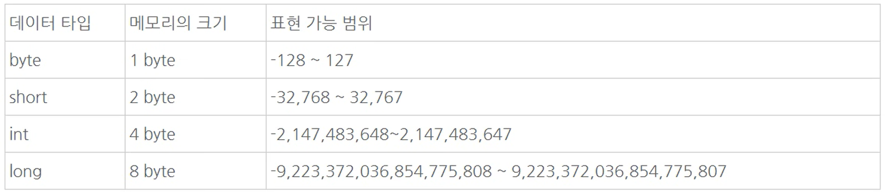
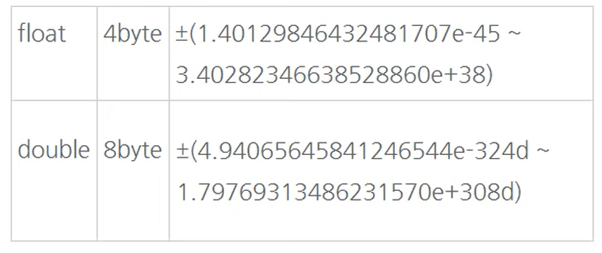

# JAVA

computer

virtual Machine

java source code

code -> compile -> .class file (this is java app) -> run   

---

## Data type

| kind | Grammer                | mean             | range      | often |
|:----:|:----------------------:|:----------------:|:----------:|:-----:|
| int  | `int`x = 30            | integer          | int < long | *     |
| int  | `long` l = 30`L`       | big integer      | wide       | *     |
| int  | `short` s = 30         | small integer    | narrow     |       |
| int  | `byte` b = 30          | small then short | narrow     |       |
| dec  | `double` dd = 30.0     | decimal          | wide       | *     |
| dec  | `float` f = 30.0`f`    | decimal          | narrow     |       |
| str  | `char`  c = `'`a`'`    | one string       | narrow     |       |
| str  | `String` s = `"`str`"` | all string       | wide       | *     |





- Just `int` , `double`

### Casting

> data type change

```java
int e = (int) 1.1;
System.out.println(e);
// 1

double b = (double) 1;
System.out.println(b);
// 1.0


String text = "1.56"
double num = Double.parseDouble(text)
System.out.println(num)
```

- `int range` is smaller than `long range`
  
  - if you want to change type `long` to  `int`
    
    ```java
    int i = (int) 30L;
    ```
  
  - but change type `int` to `long`
    
    ```java
    long l = 30;
    ```
  
  - you don't have need to change, because `long range` is bigger than `int range`
    
    this principal is same in double and float
    
    ```java
    double dd = 30.0;
    float ff = 30.0f;
    
    dd = ff; 
    ff = (float) dd;
    ```

- `string` to `int`
  
  ```java
  String str = "1000";
  
  int i = Integer.parseInt(str); // 1000
  long l = Long.parseLong(str); // 1000
  ```

- `int` to `string`
  
  ```java
  int i = 1000;
  String str = String.valueOf(i) // 1000
  
  System.out.println(i.getClass()); // class java.lang.String
  ```

### Array

- Array declaration -1

```java
public class DefineDemo {
    public static void main(String[] args) {
        String[] classGroup = { "최진혁", "최유빈", "한이람", "이고잉" };
    }
}
```

- Array declaration -2

```java
package org.opentutorials.javatutorials.array;
 
public class LengthDemo {
 
    public static void main(String[] args) {
        String[] classGroup = new String[4];
        classGroup[0] = "최진혁";
        System.out.println(classGroup.length);
        classGroup[1] = "최유빈";
        System.out.println(classGroup.length);
        classGroup[2] = "한이람";
        System.out.println(classGroup.length);
        classGroup[3] = "이고잉";
        System.out.println(classGroup.length);
 
    }
 
}
```

- for statement in array

```java
public class ArrayLoopDemo {
    public static void main(String[] args) {
        String[] members = { "최진혁", "최유빈", "한이람" };
        for (int i = 0; i < members.length; i++) {
            String member = members[i];
            System.out.println(member + "이 상담을 받았습니다");
        }
    }
}
```

```java
public class ForeachDemo {
    public static void main(String[] args) {

        String[] members = { "최진혁", "최유빈", "한이람" };
        for (String e : members) {
            System.out.println(e + "이 상담을 받았습니다");
        }
    }
}
```

---

## Grammer

| Grammer             | mean                                  |
|:-------------------:|:-------------------------------------:|
| `\n`                | enter in print                        |
| `\" \"`             | escape                                |
| `"string".length()` | string's length                       |
| &&                  | and                                   |
|                     | \|                                    |
| !                   | not (!true == false / !false == true) |

---

## Variable

java must called data type to variable 

```java
int a = 1;
double b = 1.1;
String c = "hello World";
```

---

## Const

if you don't want chage value

```java
final int x
```

---

## Input

```java
public class prac {
  public static void main(String[] args) {
    String id = args[0]
    String bright = args[1]
    System.out.println(id)
    System.out.println(bright)
  }
}
```

```java
public class prac {
  public static void main(String[] args) {
    String id = JOptionPane.showInputDialog("input here");
    System.out.println(id.getClass());
  }
}
```

---

## library

### Math

- max(a, b)
  
  - which one bigger a and b?

- min(a, b)
  
  - which one smaller a and b?

- abs(-20)
  
  - absolute value

### Random

```java
import java.util.Random;

public class Main {
    public static void main(String[] args) {
        Random random = new Random();
        random.nextInt(10);
        // ↑ 0 ~ 9
        random.nextInt(4) + 5;
        // ↑ 5 ~ 9
    }
}
```

### Scanner

```java
import java.util.Scanner

public class Main {
    public static void main(Sting[] args) {

        Scanner scanner = new Scanner(System.in);

        String str = scanner.next();
        int i = scanner.nextInt();
        long l = scanner.nextLong();
    }
}
```

```java
import java.util.Scanner;
 
public class Scanner2Demo {
 
    public static void main(String[] args) {
        Scanner sc = new Scanner(System.in);
        while(sc.hasNextInt()) {
            System.out.println(sc.nextInt()*1000); 
        }
        sc.close();
    }
}
```

- `.hasNextInt()`
  
  - is int? or not? => return true or false

- file input

```java
import java.util.Scanner;
import java.io.*;
 
public class Scanner3Demo {
 
    public static void main(String[] args) {
        try {
            File file = new File("out.txt");
            Scanner sc = new Scanner(file);
            while(sc.hasNextInt()) {
                System.out.println(sc.nextInt()*1000); 
            }
            sc.close();
        } catch(FileNotFoundException e){
            e.printStackTrace();
        }
         
    }
 
}
```

---

## if Statement

```java
public class Main {
    public static void main(String[] args) {

        int i = 10;

        if (i < 5) {
            System.out.println("it's true")
        } else if (i < 3) {
            System.out.println("it's false")
        } else {
            System.out.println("???")
        }
    }
}
```

---

## Infix Operator

```java
package org.opentutorials.javatutorials.operator;

public class PrePostDemo {
    public static void main(String[] args) {
        int i = 3;
        i++;
        System.out.println(i); // 4 출력
        ++i;
        System.out.println(i); // 5 출력
        System.out.println(++i); // 6 출력
        System.out.println(i++); // 6 출력
        System.out.println(i); // 7 출력
    }
}
```

---

## The Ternary Operator ( Condition Operator )

```java
public class Main {
    public static void main(String[] args) {

        boolean bool = true; 
        String str;

        str = bool ? "abc" : "def";

        System.out.prinln(str); // abc
    }
}


// that mean


public class Main {
    public static void main(String[] args) {

        boolean bool = true; 
        String str;

        if (bool) {
            str = "abc";
        } else {
            str = "def";
        }

        System.out.prinln(str); // abc
    }
}
```

---

## Switch Statement

```java
String str = "asdf"


switch (str) {
    case "asdf":
        system.out.println("O");
        break;
    case "zxcv":
        system.out.println("X");
        break;
    default:
        system.out.println("?")
}
```

if your code don't have break code in case

all of code will execute

---

## For Statement

### For

```java
for (int i = 0; i< 10; i++) {
    System.out.println(i)
}
```

### While

```java
int i = 0
while (i < 10) {
    System.out.println(i);
    i ++;
}
```

### Do While

```java
int i = 0;
do {
    System.out.println(i);
    i++;
} while (i < 10);
```


### For-Each

```java
class InputForeachDemo{
    public static void main(String[] args){
        for(String e : args){
            System.out.println(e);
        }
    }
}
```


### Break & Continue

- `break`
  
  - if you want to stop iteration, use this
    
    ```java
    for (int i = 0; i < 10; i++) {
      if (i == 4) {
        break;
      }
      System.out.println(i);
    }
    ```
  
  - 

- `continue`
  
  - if you want to skip iteration, use this
    
    ```java
    for (int i = 0; i < 10; i++) {
      if (i == 4) {
        continue;
      }
      System.out.println(i);
    }
    ```


---

## Method

```java

public class MethodDemo1 {
// Method define
    public static void numbering() {
        int i = 0;
        while (i < 10) {
            System.out.println(i);
            i++;
        }
    }

// Method call
    public static void main(String[] args) {
        numbering();
    }
}
```


- Parameter & Argument

```java
public class MethodDemo4 {
    public static void numbering(int limit) { // <- parameter
        int i = 0;
        while (i < limit) {
            System.out.println(i);
            i++;
        }
    }
 
    public static void main(String[] args) { // <- argument
        numbering(5);
    }
}
```

- More than two Parameter

```java
public class MethodDemo5 {
 
    public static void numbering(int init, int limit) {
        int i = init;
        while (i < limit) {
            System.out.println(i);
            i++;
        }
    }
 
    public static void main(String[] args) {
        numbering(1, 5);
    }
 
}
```

- return 
  
  - void => no return

```java
public class MethodDemo6 {
    public static String numbering(int init, int limit) {
        int i = init;
        String output = "";
        while (i < limit) {
            output += i;
            i++;
        }.
        return output;
    }
 
    public static void main(String[] args) {
        // 메소드 numbering이 리턴한 값이 변수 result에 담긴다.
        String result = numbering(1, 5);
        // 변수 result의 값을 화면에 출력한다.
        System.out.println(result);
    }
}
```

- More than two Return

```java
public class ReturnDemo4 {
 
    public static String[] getMembers() {
        String[] members = { "최진혁", "최유빈", "한이람" };
        return members;
    }
 
    public static void main(String[] args) {
        String[] members = getMembers();
    }
 
}
```

---

## Class

- method define
  
  ```java
  public class CalculatorDemo2 {
      // method define
      public static void sum(int left, int right) {
          System.out.println(left + right);
      }
   
      // main 
      public static void main(String[] args) {
          sum(10, 20);
          sum(20, 40);
      }
   
  }
  ```

- class define & use class in main
  
  ```java
  class Calculator{
      int left, right;
  
      public void setOprands(int left, int right){
          this.left = left;
          this.right = right;
      }
  
      public void sum(){
          System.out.println(this.left+this.right);
      }
  
      public void avg(){
          System.out.println((this.left+this.right)/2);
      }
  }
  
  public class CalculatorDemo4 {
  
      public static void main(String[] args) {
  
          Calculator c1 = new Calculator();
          c1.setOprands(10, 20);
          c1.sum();       
          c1.avg();       
  
          Calculator c2 = new Calculator();
          c2.setOprands(20, 40);
          c2.sum();       
          c2.avg();
      }
  }
  ```
  
  - if you want to use class, we can't use class direct, 
    
    `new` is method make class to instant
    
    and variable's type is instant's class, cause we make datatype by class
  
  - `this.left = left;``this.right = right`
    
    you can write like this
    
    ```java
    class Calculator {
    
      public void sum(int left, int right) {
        System.out.println(left + right);
      }
    
      public void avg(int left, int right) {
        System.out.println((left + right) / 2);
      }
    }
    
    public class prac {
    
      public static void main(String[] args) {
    
        Calculator c1 = new Calculator();
        c1.sum(10, 20);
        c1.avg(10, 20);
    
        Calculator c2 = new Calculator();
        c2.sum(10, 20);
        c2.avg(10, 20);
      }
    }
    ```
    
    I don't know why do like this setting the value meaning 
    
    but I guess that is instant
    
    and prevent overlapping code, maybe?
    
    **OOP's mean** 
    
    > programing pradime
    > 
    > Create logic by object maden state(variable) and behave(method)
    
    yeap my guess is right

---

## Class member and Instant member

Member is variable included class and method

Instant member's meaning is having different values for each instant

Class member's meaning is having same value every instant

```java
class Calculator{
    static double PI = 3.14;
    int left, right;

    public void setOprands(int left, int right){
        this.left = left;
        this.right = right;
    }

    public void sum(){
        System.out.println(this.left+this.right);
    }

    public void avg(){
        System.out.println((this.left+this.right)/2);
    }
}

```

static is fixed (we can use `final`)

`PI` is class member, every instant have same value

`left`, `right` is instant member can be change

If you have class member, you can access to value by class, not instant

```java
Calculator c2 = new Calculator();
System.out.println(c2.PI);
 
System.out.println(Calculator.PI);
 
```

and it can do like this

```java
class Calculator2 {
    static double PI = 3.14;
    // 클래스 변수인 base가 추가되었다.
    static int base = 0;
    int left, right;
 
    public void setOprands(int left, int right) {
        this.left = left;
        this.right = right;
    }
 
    public void sum() {
        // 더하기에 base의 값을 포함시킨다.
        System.out.println(this.left + this.right + base);
    }
 
    public void avg() {
        // 평균치에 base의 값을 포함시킨다.
        System.out.println((this.left + this.right + base) / 2);
    }
}
 
public class CalculatorDemo2 {
 
    public static void main(String[] args) {
 
        Calculator2 c1 = new Calculator2();
        c1.setOprands(10, 20);
        // 30 출력
        c1.sum();
 
        Calculator2 c2 = new Calculator2();
        c2.setOprands(20, 40);
        // 60 출력
        c2.sum();
 
        // 클래스 변수 base의 값을 10으로 지정했다.
        Calculator2.base = 10;
 
        // 40 출력
        c1.sum();
 
        // 70 출력
        c2.sum();
    }
}
```

- Reason of Class Member
  
  - case of fixed value regardless of instant
  
  - case of accessing value by class directly
  
  - case of sharing value's change every instant


---

## Class method
