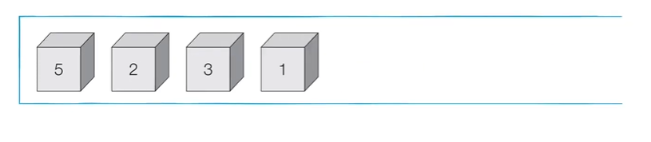
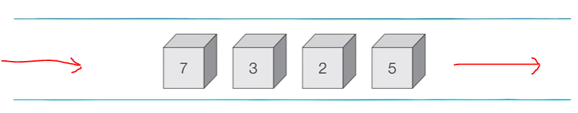

# Java

---

## Stack



```java
import java.util.*;

public class Main {

    public static void main(String[] args) {
        Stack<Integer> s = new Stack<>();

        // 삽입(5) - 삽입(2) - 삽입(3) - 삽입(7) - 삭제() - 삽입(1) - 삭제()
        s.push(5); // 5
        s.push(2); // 5 2
        s.push(3); // 5 2 3
        s.push(7); // 5 2 3 7
        s.pop(); // 5 2 3
        s.push(1); // 5 2 3 1
 
        // 스택의 최상단 원소부터 출력 => 1 3 2 5
        while (!s.empty()) {
            System.out.println(s.peek());
            s.pop();
        }
    }
}
```


---

## Queue



```java
import java.util.*;


public class Main {
    public static void main(string[] args) {
        Queue<Integer> q = new LinkedLIst<>();
        q.offer(5); // 5
        q.offer(2); // 2 5
        q.offer(3); // 3 2 5
        q.offer(7); // 7 3 2 5
        q.poll(); // 7 3 2
        q.offer(1); // 1 7 3 2
        q.offer(4); // 4 1 7 3 2
        q.poll(); // 4 1 7 3

        // print q out in the order argument come in first
        while(!q.isEmpty()) {
            System.out.print(q.poll() + " ");
            // 3 7 1 4
        }
    }
}
```


