# ClassView


```python
# url.py


urlpatterns = [
    path('', views.PostCreateView.as_view(), name="create")
]
```


---

## Generic View


### CreateView

```python
from django.views.generic import CreateView

classs PostCreateView(CreateView):
    model = Post
    form_class = PostForm
    template_name = "posts/post_form.html"
```


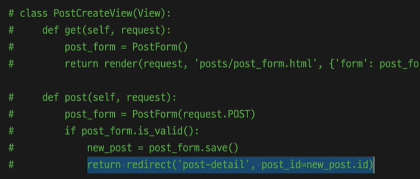

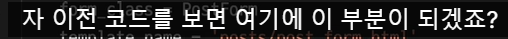

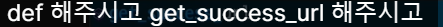


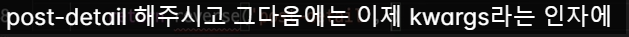

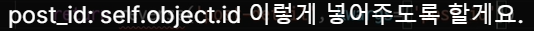

```python
from django.views.generic import CreateView
########################################
from django.urls import reverse
########################################

classs PostCreateView(CreateView):
    model = Post
    form_class = PostForm
    template_name = "posts/post_form.html"

    ########################################
    def get_success_url(self):
        return reverse('post-detail', 
               kwargs={'post_id':self.object.id})
    ########################################
```

```python
def get_success_url(self):
        # self.object는 이 CreateView에서 새로 생성한 데이터 모델을 말합니다.
        return reverse('<이동할 URL>', kwargs={'<URL에 전달할 키워드>': <전달할 값>})
```

###### Reverse

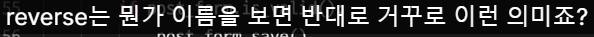

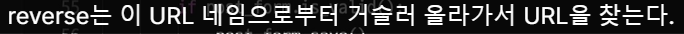

###### Kwargs


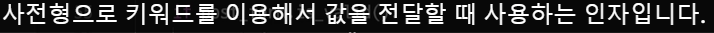

###### self.object


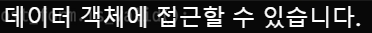


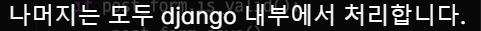

---

### ListView


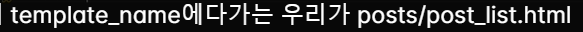


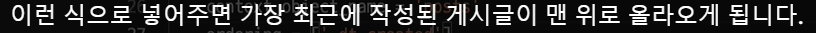

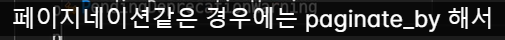

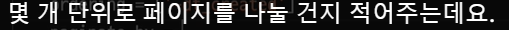


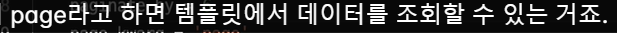

```python
from django.views.generic import ListView

class PostListView(ListView):
    model = Post
    template_name="posts/post_list.html"
    context_object_name="posts"
    ordering = ['-dt_created']
    paginate_by = 6
    page_kwarg = 'page'
```

#### how to write Html with ListView

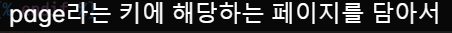


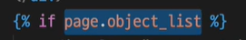


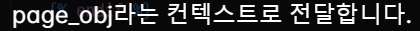

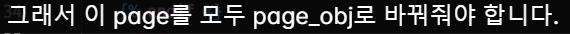

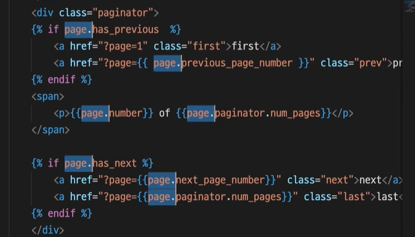

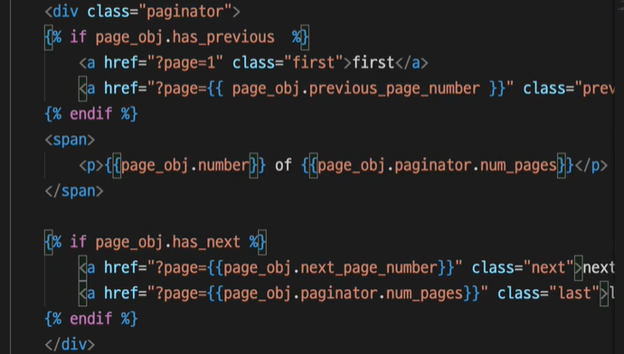

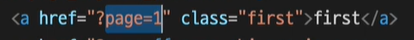


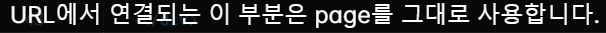

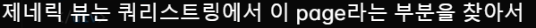

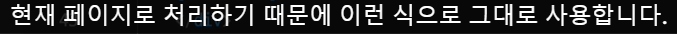

---

### DetailView


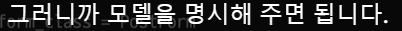


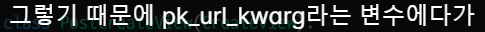


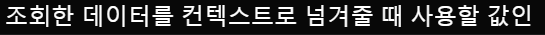


```python
from django.views.generic import DetailView

class PostDetailView(DetailView):
    model = Post
    template_name = "posts/post_detail.html"
    pk_url_kwarg = "post_id"
    context_object_name = "post"
```

---

### UpdateView

```python
from django.views.generic import UpdateView

class PostUpdateView(UpdateView):
    model = Post
    form_class = PostForm
    template_name = 'posts/post_form.html'
    pk_url_kwarg = 'post_id'

    def get_success_url(self):
        return reverse('post-detail', kwargs={'post_id': self.object.id})
```

---

### DeleteView

```python
from django.views.generic import DeleteView

class PostDeleteView(DeleteView):
    model = Post
    template_name = 'posts/post_confirm_delete.html'
    pk_url_kwarg = 'post_id'
    context_object_name = 'post'

    def get_success_url(self):
        return reverse('post-list')
```


---

## Context in GenericView


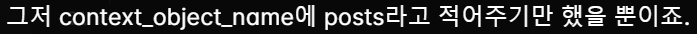

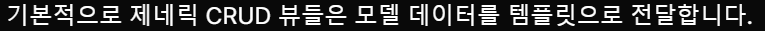

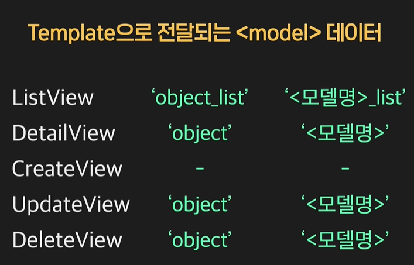

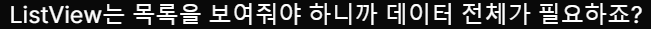

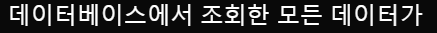

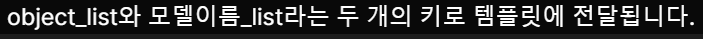

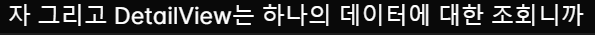


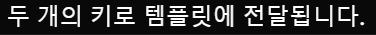


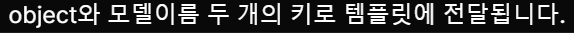


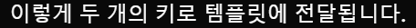


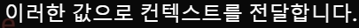

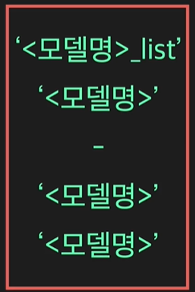

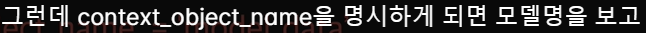


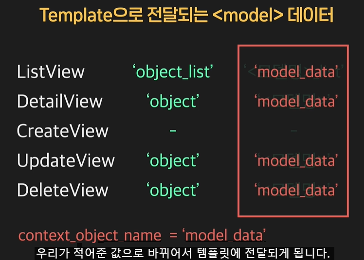


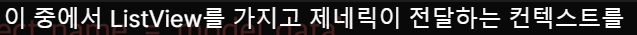

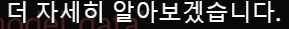

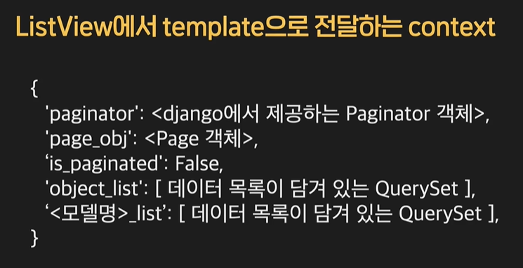


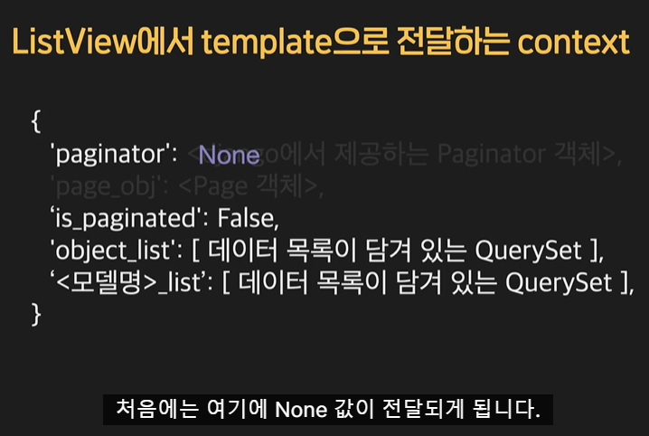

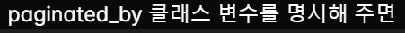

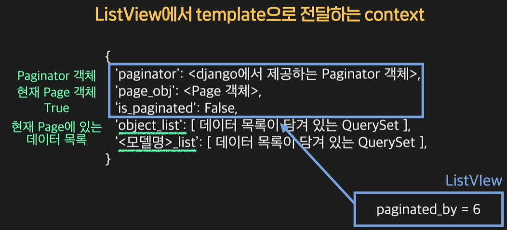

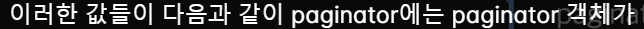

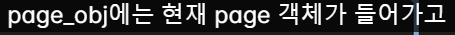


---

## Make simple GenericView

### Simple ListView


  


| object_list                               |
| ----------------------------------------- |
|  |


---

### Simple DetailView


**template_name**


**pk_url_kwarg**


**context_object_name**


---

### CreateView


**model**

It doesn't have default value

**form_class** 

It doesn't have default value


**template_name**


**get_success_url**


---

### UpdateView


**form_class**

it doesn't have default value


**template_name**


**pk_url_kwarg**


**get_success_url**


---

### DeleteView


**template_name**


**pk_url_kwarg**

default = pk


**context_object_name**


---

## RedirectView


