# CreateView Custom

## urls.py

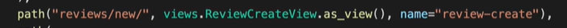

## views.py


## decorator / mixin

##### Process to deal with request

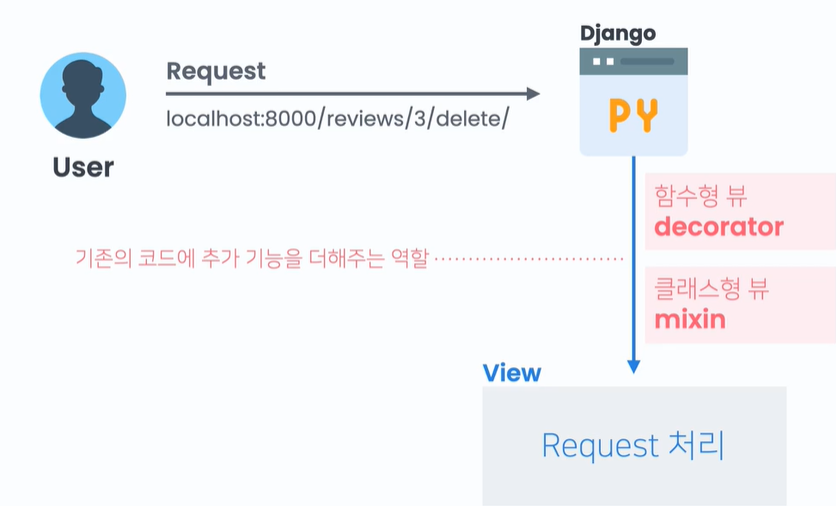

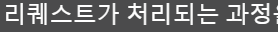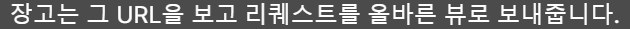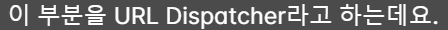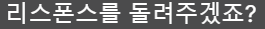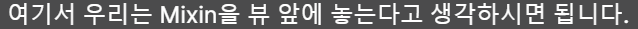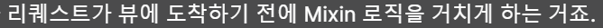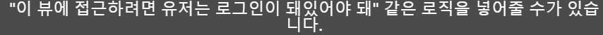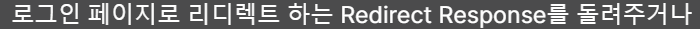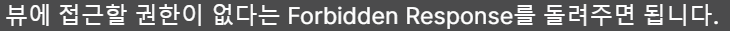

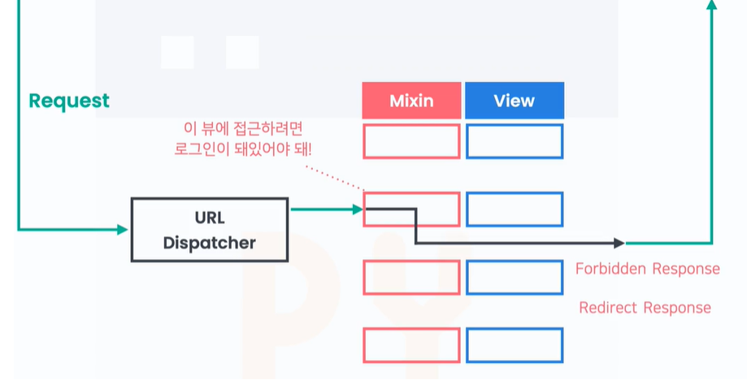

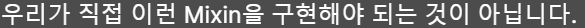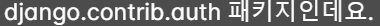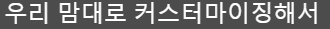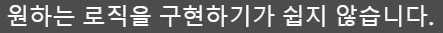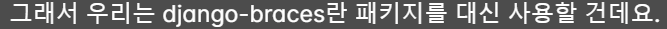

### django-braces

#### Access Mixxin

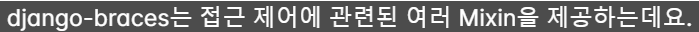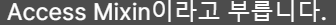

```bash
pip install django-braces
```

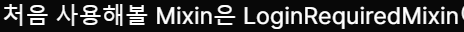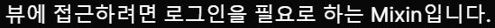

```python
# views.py

from braces.views import LoginRequiredMixin

class ReviewCreteView(LoginRequiredMixin, CreateView):
    ...
```

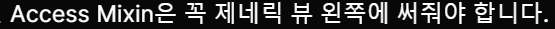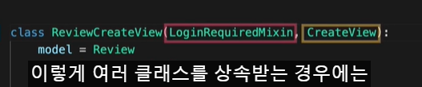

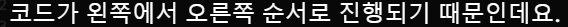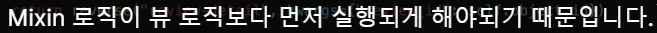

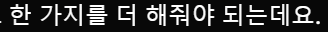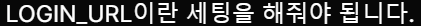

```python
# settings.py

LOGIN_URL = "account_login"
```

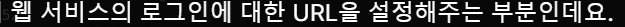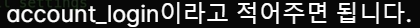

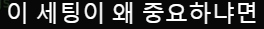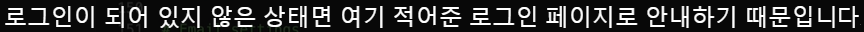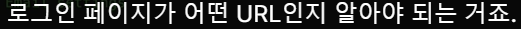

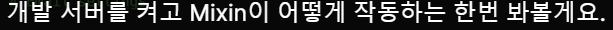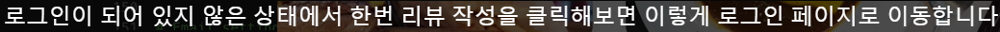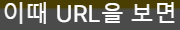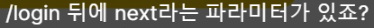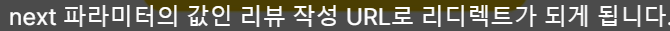

---

#### UserPassesTextMixin

##### verify email certification

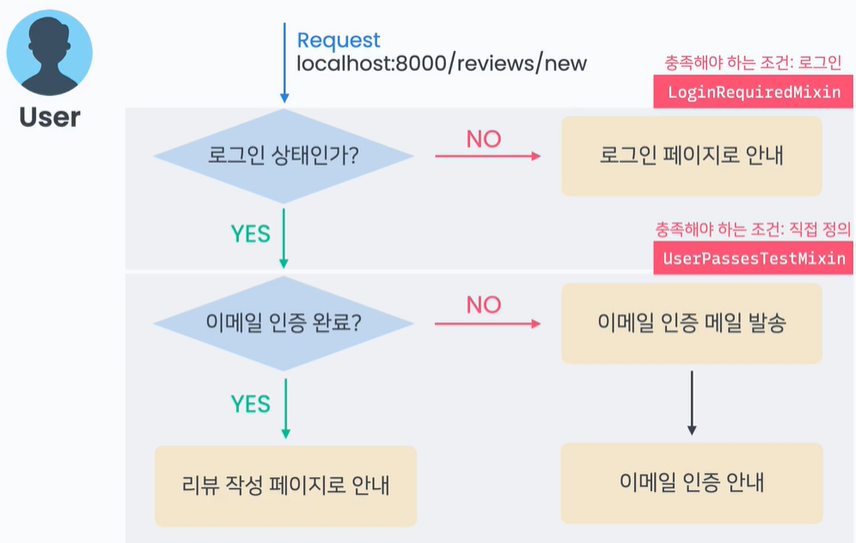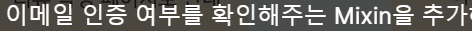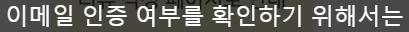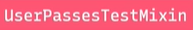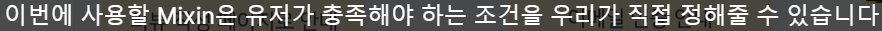

```python
# views.py

from braces.views import UserPassesTestMixin

class ReviewCreteView(LoginRequiredMixin,UserPassesTestMixin,CreateView):
    ...
```

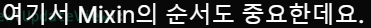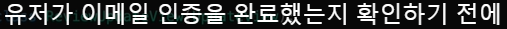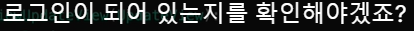

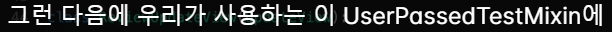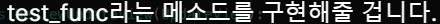

```python
# views.py

from braces.views import UserPassesTestMixin

class ReviewCreteView(LoginRequiredMixin,UserPassesTestMixin,CreateView):
    ...
    def test_func(self, user):
        
```

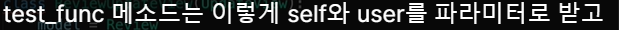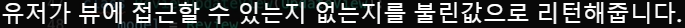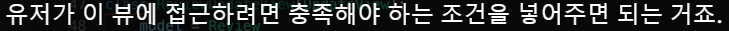

```python
# views.py

from braces.views import UserPassesTestMixin
from allauth.account.models import EmailAddress

class ReviewCreteView(LoginRequiredMixin,UserPassesTestMixin,CreateView):
    ...
    def test_func(self, user):
       if EmailAddress.objects.filter(user=user, verified=True).exists():
```


```python
# views.py

from braces.views import UserPassesTestMixin
from allauth.account.models import EmailAddress

class ReviewCreteView(LoginRequiredMixin,UserPassesTestMixin,CreateView):
    ...
    def test_func(self, user):
       if EmailAddress.objects.filter(user=user, verified=True).exists():
            return True
       else:
            return False
# Email--exists() return the boolen, so..

    def test_func(self, user):
       return EmailAddress.objects.filter(user=user, verified=True).exits
```

### Control process, if User can't pass the Mixin

**Make process going login page or sending certicate email**


**redirect_unauthenticated_users**


**raise_exception**


**urls.py**


```python
# functions.py

from django.shortcuts import redirect
from allauth.account.utils import send_email_confirmation

def confirmation_required_redirect(self, request):
    send_email_confirmation(request, request.user)
    return redirect("account_email_conirmation_required")
```


## Final code

```python
# views.py

from .functions import confirmation_reuired_redirect
from braces.views import LoginRequiredMixin, UserPassesTestMixin
from allauth.account.models import EmailAddress

class ReviewCreteView(LoginRequiredMixin,UserPassesTestMixin,CreateView):
  model = Review
  form_class = ReviewForm
  template_name = "coplate/review_form.html"

  redirect_unauthenticated_users = True
  raise_exception = confirmation_required_redirect

  def form_valid(self, form):
     form.nstance.author = self.request.user
     return super().form_valid(form)
  def get_success_url(self)L
     return reverse("review-detail", kwargs={"review_id":self.object.id})
  def test_func(self, user):
     return EmailAddress.objects.filter(user=user,verified=True).exists()
```


---

# UpdateView_Custom

**urls.py**


**views.py**


```python
# views.py

from django.views.generic import UpdateView

class ReviewUdateView(UpdateView):
    model = Review
    form_class = ReviewForm
    template_name = "coplate.review_form.html"
    pk_url_kwarg = "review_id"

    def get_success_url(self)
        return reverse("review-detail", 
            kwargs={"review_id":self.object.id})
```


**template**


## Mixin


```python
# views.py

from django.views.generic import UpdateView
from braces.views import LoginRequiredMixin, UserPassesTestMixin

class ReviewUdateView(LoginRequiredMixin,UserPassesTestMixin,UpdateView):
    model = Review
    form_class = ReviewForm
    template_name = "coplate.review_form.html"
    pk_url_kwarg = "review_id"

    raise_exception = True    

    def get_success_url(self)
        return reverse("review-detail", 
            kwargs={"review_id":self.object.id})

    def test_func(self, user):
        review = self.get_object()
        return review.author == uwer
```


---

# deleteView Custom

**urls.py**


**views.py**


**template**

```html




<form method="post">
    
    <span> really want delete review? </span>
    <button type="submit">delete</button>
    <a href="">cancel</a>
</form>


```


## Mixin


```python
# views.py

from django.views.generic import deleteView
from braces.views import LoginRequiredMixin, UserPassesTestMixin

class ReviewUdateView(LoginRequiredMixin,UserPassesTestMixin,DeleteView):
    model = Review
    form_class = ReviewForm
    template_name = "coplate.review_confirm_delete.html"
    pk_url_kwarg = "review_id"

    raise_exception = True    

    def get_success_url(self)
        return reverse("review-detail", 
            kwargs={"review_id":self.object.id})

    def test_func(self, user):
        review = self.get_object()
        return review.author == uwer
```
