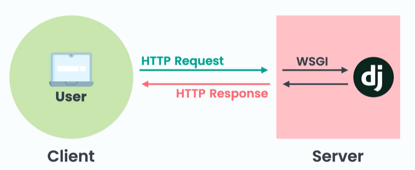
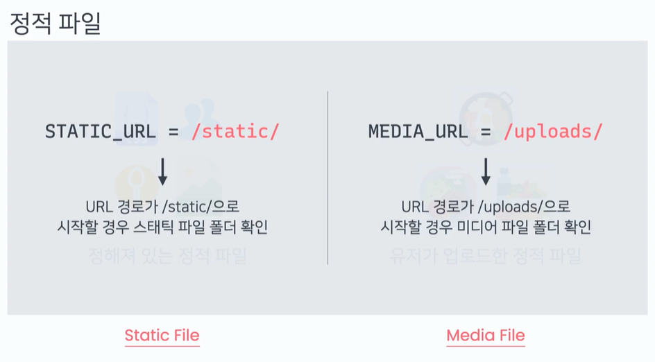

# Deploy 배포

**Production (프로덕션)**
프로덕션은 웹 어플리케이션이 배포된 후 실제로 운영되고 있는 상태
프로덕션에 사용되는 환경을 프로덕션 환경이라고 한다
파이썬 웹어플리케이션을 배포하는데 특화된 pythonAnywhere 라는 서비스를 이용해서 프로젝트를 배포할 거임

프로젝트 폴더를 압축함
로그인을 하고 오른쪽 상단에 files를 누른 후
upload a file을 누른 다음 방금 압축한 프로젝트 파일을 업로드 한다
업로드가 되면  open bash console here 을 누르고 콘솔창을 연다
unzip이라고 쓰고 파일 이름을 써준다
그리고 나서 창으로 다시 돌아와 settings.py를 연다

```python
DEBUG = FALSE
ALLOWED_HOST = [".pythonanywhere.com"]
```

그 다음 save를 누른다
가상환경은 우측 상단의 햄버거를 선택해
consoles를 우클릭 한 다음 새 탭에서 링크열기를 선택한다
Your consoles 에 우리가 작업했던 콘솔이 그대로 있습니다 클릭한다
이 서버에는 pyenv 가 설치되지 않았기 때문에 가상 환경을 만드는 방법이 다르다

```bash
# python 3.7 버전으로 django_coplate_env라는 가상 환경 만들기
virtualenv --python=python3.7 django_coplate_env

# 방금 생성한 가상 환경을 적용해 주려면 
source django_coplate_env/bin/activate

pip install django==2.2 django-allauth django-widget-tweaks pillow django-braces
```

다시 오른쪽 상단 햄버거를 눌러서 web을 마우스 오른쪽 클릭해서
새 탭으로 링크 열기를 선택
파란 버튼의 Add a new web app을 추가
next 를 누르고 그 다음에는  Manual configuration을 선택,
버전은 python 3.7버전 하고 next를 누름
좀 아래로 내려서 Code: 부분을 본다
소스코드의 경로는
 /home/파이썬애니웨어아이디/프로젝트이름/
 그 다음 WSGI configuration file 을 수정한다


**WSGI란?**



웹 서버와 장고 프레임워크가 소통하는 방식
장고 코드를 어떻게 실행할 것인지를 말해주는 파일

WSGI configuration file을 클릭해서 파일을 연다
19번째줄 ~ 47번째줄 코멘트 처리한다

74번째줄에 +++ DJANGO +++ 가 있는데 
76번째부터 89번째 줄을 주석 해제하고
81번째 줄 path의 mysite 부분을 프로젝트 이름으로 바꾼다
85번째줄의 mysite도 프로젝트 이름으로 바꾼다

그 다음 밑으로 내려서 virtualenv 가상환경의 경로를 넣어준다
/home/파이썬애니웨어아이디/가상환경이름

프로덕트 단계에서는
정적파일은 장고가 안 찾고 서버가 찾아주는게 더 효율적임
장고는 request 들어오면 로직으로 처리하고 response (=보통 html 페이지)을 내보내 주는데 이 html 파일은 웹사이트의 게시물에 따라 내용이 바뀜 
필요한 데이터를찾고 html 파일데이터 렌더하고 response 보내주는 걸 장고가 해줌
근데 정적파일은 바뀌지 않는 파일이기 때문에 따로 처리할 로직이 없어서 파일 돌려주기만 하면 됨
그래서 그 리퀘스트를 장고가 아닌 서버가 정적 파일을 찾아서 클라이언트한테 돌려준다
정적 파일에 대한 request 들어오면 서버 안에 있는 특정 폴더 안을 찾아보라고 설정해주면 서버가 찾아줌

css, icon, desigin file은 static 
세팅 파일에서는 STATIC_URL = /static/
유저가 업로드한 파일은 media
세팅 파일에서는 

|                | STATIC                                 | MEDIA                                  |
| -------------- | -------------------------------------- | -------------------------------------- |
| file 종류        | CSS, Icon, design file                 | 유저가 업로드한 파일                            |
| setting url 경로 | STATIC_URL=/static/                    | MEDIA_URL=/uploads/                    |
| 파일 확인          | url 경로가 /static/으로 시작할 경우 static 파일 확인 | url 경로가 /uploads/으로 시작할 경우 media 폴더 확인 |



미디어 파일은 media 라는 폴더 한 곳에 모여 있지만 스태틱 파일은 여러 군데에 흩어져 있음
스태틱 파일은 coplate 앱 안에 있고 admin 앱 안에 사용되는 스태틱 파일은 admin 앱 안에 있음 이런 모든 스태틱 파일을 한 곳에 모아주고 나서 서버에게 여기서 모든 파일을 찾으면 된다고 하고 싶음
그래서 웹사이트를 배포할 때는 모든 스태틱 파일을 한 폴더 안으로 모아주는데 그걸 해주는 커맨드가 collectstatic 커맨드 임
이 커맨드는 우리가 지정한 폴더 안에 장고 프로젝트의 모든 스태틱 파일 을 모아주는 역할을 함
이 폴더는 세팅 파일에 **STATIC_ROOT**란 설정을 통해 정할 수 있음
세팅 탭으로 돌아가서 STATIC_URL을 찾은 다음에 이 위쪽에

```python
STATIC_ROOT = os.path.join(BASE_DIR, "static")
```

를 써줌 세이브 해 준 다음에 콘솔탭으로 넘어가서
프로젝트파일로 들어가서 manage.py 이용해서

```bash
python manage.py collectstatic
```

하면 static 폴더가 생김

그리고 setup 창에 가서 static files 를 보면 
URL 은 enter URL 을 클릭한 후에 /static/을 입력하고 
Directory에는 /home/아이디/프로젝트이름/static

미디어파일도 등록해주는데
URL 에는 /uploads/
Directory 에는 /home/아이디/프로젝트이름/media

맨 위로 올라와서 리로드를 누르고 나오는 링크도 클릭해보면 
배포완료!
