# CreateView Custom

## urls.py

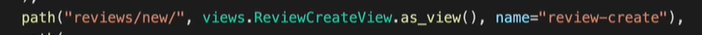

## views.py


## decorator / mixin

##### Process to deal with request

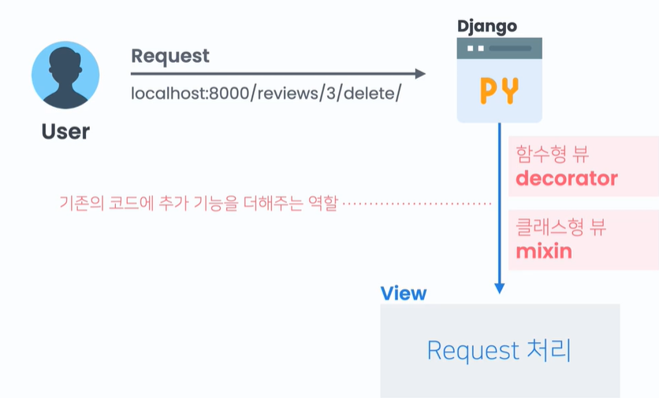

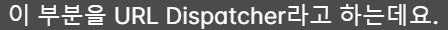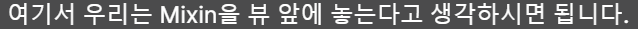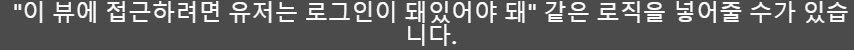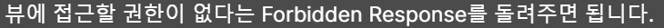

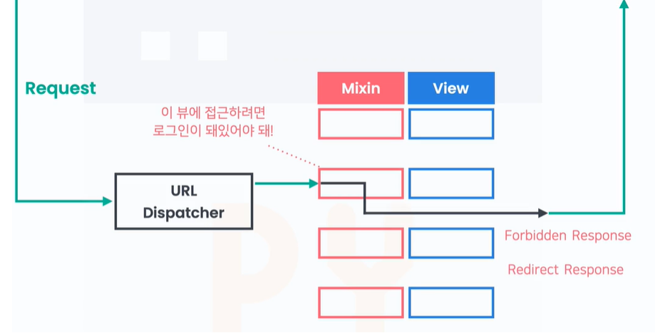

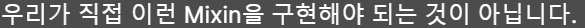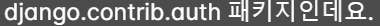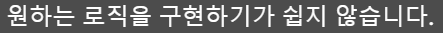

### django-braces

#### Access Mixxin

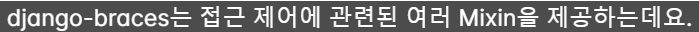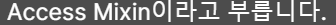

```bash
pip install django-braces
```

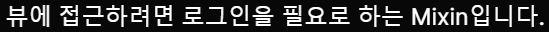

```python
# views.py

from braces.views import LoginRequiredMixin

class ReviewCreteView(LoginRequiredMixin, CreateView):
    ...
```

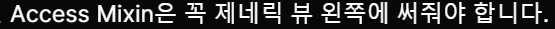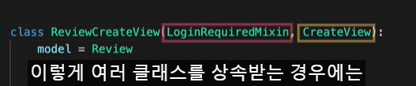

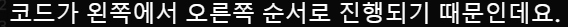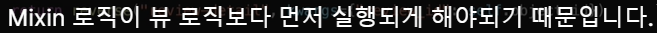


```python
# settings.py

LOGIN_URL = "account_login"
```

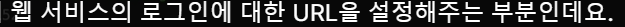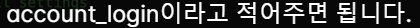

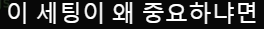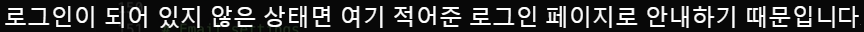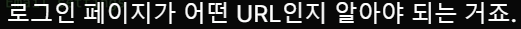

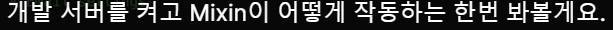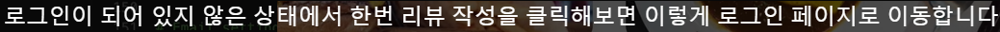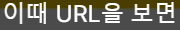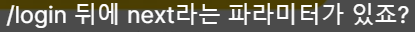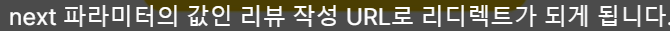

---

#### UserPassesTextMixin

##### verify email certification

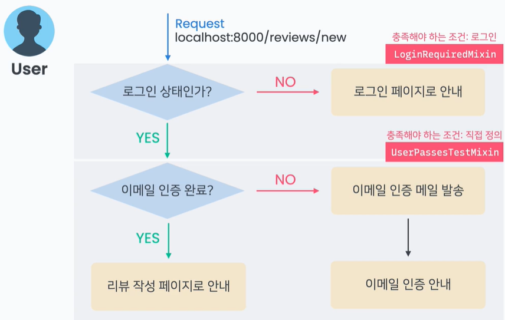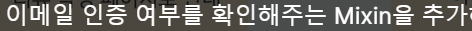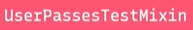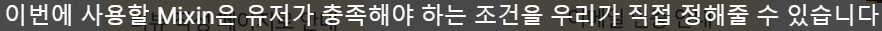

```python
# views.py

from braces.views import UserPassesTestMixin

class ReviewCreteView(LoginRequiredMixin,UserPassesTestMixin,CreateView):
    ...
```

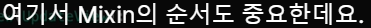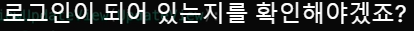

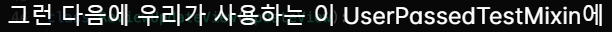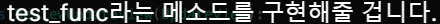

```python
# views.py

from braces.views import UserPassesTestMixin

class ReviewCreteView(LoginRequiredMixin,UserPassesTestMixin,CreateView):
    ...
    def test_func(self, user):
        
```

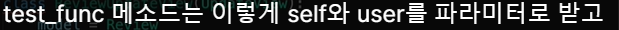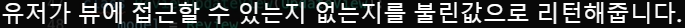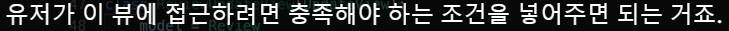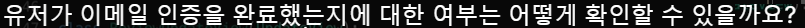

```python
# views.py

from braces.views import UserPassesTestMixin
from allauth.account.models import EmailAddress

class ReviewCreteView(LoginRequiredMixin,UserPassesTestMixin,CreateView):
    ...
    def test_func(self, user):
       if EmailAddress.objects.filter(user=user, verified=True).exists():
```

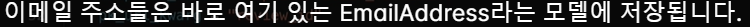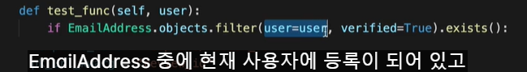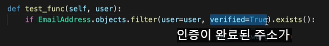

```python
# views.py

from braces.views import UserPassesTestMixin
from allauth.account.models import EmailAddress

class ReviewCreteView(LoginRequiredMixin,UserPassesTestMixin,CreateView):
    ...
    def test_func(self, user):
       if EmailAddress.objects.filter(user=user, verified=True).exists():
            return True
       else:
            return False
# Email--exists() return the boolen, so..

    def test_func(self, user):
       return EmailAddress.objects.filter(user=user, verified=True).exits
```

### Control process, if User can't pass the Mixin

**Make process going login page or sending certicate email**

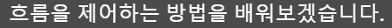

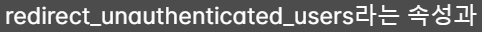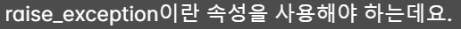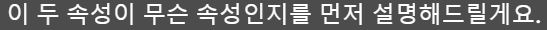

**redirect_unauthenticated_users**

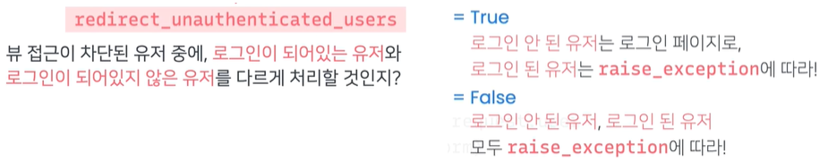

**raise_exception**

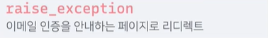

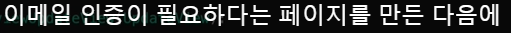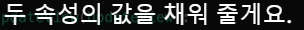

**urls.py**


```python
# functions.py

from django.shortcuts import redirect
from allauth.account.utils import send_email_confirmation

def confirmation_required_redirect(self, request):
    send_email_confirmation(request, request.user)
    return redirect("account_email_conirmation_required")
```


## Final code

```python
# views.py

from .functions import confirmation_reuired_redirect
from braces.views import LoginRequiredMixin, UserPassesTestMixin
from allauth.account.models import EmailAddress

class ReviewCreteView(LoginRequiredMixin,UserPassesTestMixin,CreateView):
  model = Review
  form_class = ReviewForm
  template_name = "coplate/review_form.html"

  redirect_unauthenticated_users = True
  raise_exception = confirmation_required_redirect

  def form_valid(self, form):
     form.nstance.author = self.request.user
     return super().form_valid(form)
  def get_success_url(self)L
     return reverse("review-detail", kwargs={"review_id":self.object.id})
  def test_func(self, user):
     return EmailAddress.objects.filter(user=user,verified=True).exists()
```


---

# UpdateView_Custom

**urls.py**


**views.py**


```python
# views.py

from django.views.generic import UpdateView

class ReviewUdateView(UpdateView):
    model = Review
    form_class = ReviewForm
    template_name = "coplate.review_form.html"
    pk_url_kwarg = "review_id"

    def get_success_url(self)
        return reverse("review-detail", 
            kwargs={"review_id":self.object.id})
```


**template**


## Mixin


```python
# views.py

from django.views.generic import UpdateView
from braces.views import LoginRequiredMixin, UserPassesTestMixin

class ReviewUdateView(LoginRequiredMixin,UserPassesTestMixin,UpdateView):
    model = Review
    form_class = ReviewForm
    template_name = "coplate.review_form.html"
    pk_url_kwarg = "review_id"

    raise_exception = True    

    def get_success_url(self)
        return reverse("review-detail", 
            kwargs={"review_id":self.object.id})

    def test_func(self, user):
        review = self.get_object()
        return review.author == uwer
```


---

# deleteView Custom

**urls.py**


**views.py**


**template**

```html




<form method="post">
    
    <span> really want delete review? </span>
    <button type="submit">delete</button>
    <a href="">cancel</a>
</form>


```


## Mixin


```python
# views.py

from django.views.generic import deleteView
from braces.views import LoginRequiredMixin, UserPassesTestMixin

class ReviewUdateView(LoginRequiredMixin,UserPassesTestMixin,DeleteView):
    model = Review
    form_class = ReviewForm
    template_name = "coplate.review_confirm_delete.html"
    pk_url_kwarg = "review_id"

    raise_exception = True    

    def get_success_url(self)
        return reverse("review-detail", 
            kwargs={"review_id":self.object.id})

    def test_func(self, user):
        review = self.get_object()
        return review.author == uwer
```

# DetailView


**urls.py**

```python
urlpatterns = [
    ...
    path("user/<int:user_id>/", views.ProfileView.as_view(), 
    name="profile"),
    ...
]
```

**views.py**


```python
from django.views.generic import DetailView

class ProfileView(DetailView):
    model = User
    template_name = "coplate/profile.html"
    pk_url_kwarg = "user_id"
    context_object_name = "profile_user"
```


  

```python
from django.views.generic import DetailView

class ProfileView(DetailView):
    model = User
    template_name = "coplate/profile.html"
    pk_url_kwarg = "user_id"
    context_object_name = "profile_user"

    def get_conext_data(self, **kwargs):
        context = super().get_context_data(**kwargs)
        user_id = self.kwargs.get("user_id")
        context["user_reviews"] = (
            Review.objects.filter(author__id).order_by("-dt_created")[:4]
        )
        return context
```


# ListView Custom

특정 유저가 가지고 있는 리뷰만 전달하고 싶을 때
(=listView가 전달하는 object를 바꾸고 싶으면)
get_queryset이란 메소드를 오버라이드 해주면 된다

```python
# views.py
class UserReviewListView(ListView):
    model = Review
    template_name = "coplate/user_review_list.html"
    context_object_name = "user_reviews"
    paginate_by = 4

    # 원래는 리뷰 전체 모델오브젝트를 다 가져오는데
    # 그걸 메소드를 오버라이딩 해서 특정 유저가 작성한 리뷰만 리턴하도록 함
    def get_queryset(self):
        user_id = self.kwargs.get("user_id")
        return Review.objects.filter(author__id=user_id).order_by("dt_created")
```

리스트뷰에 컨텍스트로 리뷰만 전달되고 리뷰의 작성자가 전달되지 않아
작성자도 전달하려고 함 => get_context_data 메소드 오버라이드

```python
# views.py
from django.shortcuts import get_object_or_404

class UserReviewListView(ListView):
    model = Review
    template_name = "coplate/user_review_list.html"
    context_object_name = "user_reviews"
    paginate_by = 4

    # 원래는 리뷰 전체 모델오브젝트를 다 가져오는데
    # 그걸 메소드를 오버라이딩 해서 특정 유저가 작성한 리뷰만 리턴하도록 함
    def get_queryset(self):
        user_id = self.kwargs.get("user_id")
        return Review.objects.filter(author__id=user_id).order_by("dt_created")
        # 메소드를 정의하고 기존의 컨텍스트를 가져와서 그대로 전달
    def context_data(self, **kwargs):
        context = super().get_context_data(**kwargs)
        # 찾는 유저가 없으면 404 에러를 냄
        # get_object_or_404(오브젝트를 찾을 모델, 찾을때 조건)
        # 함수가 조회한 유저를 등록함
        context["profile_user"]=
        get_object_or_404(User, id=self.kwargs.get("user_id"))
        return context
```

**template** 리뷰 쓴 총개수를 알고 싶을 때 쓴다

```html
{{ paginator.count }}
```

# UpdateView Custom

**urls.py**

```python
url_pattern = [
    ...
    path("set-profile/",
        views.ProfileSetView.as_view(),
        name="profile-set"),
]
```

**views.py** 프로필정보 설정페이지는 생성 되어있는 유저오브젝트에 프로필에 관련된 필드를 설정해주는 역할이기 때문에 updateview

보통 updateview는 어떤 오브젝트를 업데이트 할 지 알고
이 오브젝트 아이디가 url에 전달되고 
pk_url_kwarg를 이용해서 설정해 주는데
유저 아이디가 url로 전달되지 않음, 업데이트할 유저는 현재 들어와 있는 유저이기 때문
업데이트를 해야 할 오브젝트를 updateview에 알려줄 수 있는 것이
get_object 메소드 임

업데이트 하고 나서 리디렉트 할 url 적어줘야 함

```python
# views.py
from .forms import ProfileForm

class ProfileSetView(UpdateView):
    model = User
    form_class = ProfileForm
    template_name = "coplate/profile_set_form.html"    

    # 여기서 현재 유저를 리턴해주면 됨
    def get_object(self, queryset=None):
        # 현재 유저를 돌려줌
        return self.request.user

    def get_success_url(self):
        return reverse("index")
```

ListView는 여러 오브젝트를 다루니까 get_queryset 메소드 오버라이드
UpdateView는 한 오브젝트를 다루니까 get_object 메소드 오버라이드
=> 따라서 하나의 오브젝트를 다루는 detailview, createview, deleteview 모두 get_object 메소드를 오버라이드 할 수 있다

```python
# forms.py
class ProfileForm(forms.ModelForm):
    class Meta:
        model = User
        fields = [
            "nickname", "profile_pic", "intro",
        ]
        widgets = {
            "intro": forms.Textarea,
        }
```
