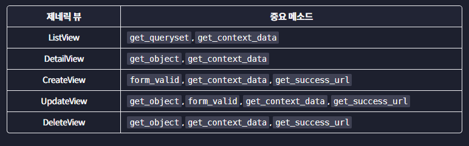

Django에서 CRUD 기능을 구현하는 가장 간편한 방법은 제네릭 뷰를 사용하는 겁니다. 제네릭 뷰를 잘 사용하려면 제네릭 뷰의 속성과 메소드를 이해하고 있어야 하는데요. 제네릭 뷰의 속성에 대한 정리 노트는 [여기](https://www.codeit.kr/learn/courses/django-web-development/4183)서 확인하실 수 있습니다. 이번 정리 노트에서는 우리가 배운 제네릭 뷰 메소드들을 정리해 드릴게요.

# `get_success_url`  메소드

`get_success_url` 메소드는 POST 리퀘스트를 처리하는 `CreateView`, `UpdateView`, `DeleteView`에서 사용됩니다.

POST 리퀘스트가 성공적으로 처리됐을 때 (예를 들어 오브젝트가 성공적으로 생성됐을 때) 리디렉트되는 URL을 정하는 건데요. `CreateView`, `UpdateView`, `DeleteView`를 사용할 때는 `get_success_url` 메소드를 정의해 줘야 합니다.

```python
# URL 파라미터가 없는 경우
class MyView(CreateView):
    ...

    def get_success_url(self):
        return reverse('index')

# URL 파라미터가 있는 경우
class MyView(CreateView):
    ...

    def get_success_url(self):
        return reverse('review-detail', kwargs={'review_id': self.object.id})
```

URL 경로를 직접 입력하지 않고 URL 네임을 사용하는 것이 좋고, 뷰가 다루고 있는 오브젝트는 `self.object`로 접근할 수 있습니다.

# `form_valid`  메소드

`form_valid` 메소드는 폼을 사용하는 `CreateView`, `UpdateView`에서 사용됩니다.

`form_valid` 메소드는 폼 데이터가 모두 유효하면 폼 데이터를 새로운 오브젝트(`CreateView`), 또는 기존의 오브젝트(`UpdateView`)에 저장해 주는 역할을 합니다. 폼 데이터가 저장되기 전에 어떤 액션을 취하고 싶다면 `form_valid` 메소드를 **오버라이딩**해 주면 됩니다. `CreateView` (또는 `UpdateView`)에 이미 정의돼있는 `form_valid` 메소드를 우리 클래스에서 새로 정의해서 코드의 동작을 바꿔주는 거죠.

```python
# 폼 데이터가 오브젝트에 저장되기 전에, author 필드를 만들어 준다
class MyView(CreateView):
    ...

    def form_valid(self, form):
        form.instance.author = self.request.user
        return super().form_valid(form)
```

위 코드는 폼에 `author`라는 필드를 추가해 주고, `CreateView`의 `form_valid` 메소드를 호출해서 폼 데이터를 오브젝트에 저장해 줍니다. `super()`는 상속 대상(위 코드의 경우 `CreateView`)을 뜻합니다. 기존 메소드의 동작을 완전히 바꾸고 싶은 게 아니라, 중간에 어떤 로직을 추가해 주고 싶을 때는 `super()`를 이용해서 기존 메소드를 호출해 주면 됩니다.

# `get_context_data`  메소드

`get_context_data` 메소드는 모든 제네릭 뷰에서 사용됩니다.

`get_context_data` 메소드는 템플릿에 전달되는 컨텍스트(여러 변수와 데이터)를 정해주는 메소드입니다. 이 메소드를 오버라이딩해서 컨텍스트에 데이터를 추가할 수 있습니다.

```python
class MyView(DetailView):
    ...

    def get_context_data(self, **kwargs):
        context = super().get_context_data(**kwargs)
        # context 딕셔너리에 데이터 추가
        # 예: context['foo'] = 'bar'
        return context
```

`super()`를 활용해서 원래 전달되는 컨텍스트를 가져오고, 컨텍스트에 데이터를 추가해 준 다음, 컨텍스트를 리턴해 주면 됩니다.

# `get_queryset`  메소드

`get_queryset` 메소드는 `ListView`에서 보여 줄 오브젝트 리스트를 설정해 줍니다. 기본적으로 `model`에 해당하는 모든 오브젝트를 리턴해 주는데, 이걸 바꿔주고 싶으면 `get_queryset` 메소드를 오버라이딩하면 됩니다.

```python
class MyView(ListView):
    model = Foo
    ...

    def get_queryset(self):
        return Foo.objects.filter(<조건>)
```

# `get_object`  메소드

`get_object` 메소드는 `DetailView`, `UpdateView`, `DeleteView`에서 다루는 오브젝트를 설정해 줍니다. (`DetailView`에서 보여 줄 오브젝트, `UpdateView`에서 수정할 오브젝트, `DeleteView`에서 삭제할 오브젝트 - `CreateView`는 기존의 오브젝트를 다루는 것이 아니라 새로운 오브젝트를 생성하는 거기 때문에 `get_object` 메소드가 사용되지 않습니다.)

기본적으로 `pk_url_kwarg` 파라미터로 전달되는 id값을 가진 오브젝트를 리턴해 주는데, 이걸 바꿔주고 싶으면 `get_object` 메소드를 오버라이드해 주면 됩니다.

```python
class MyView(UpdateView):
    model = Foo

    def get_object(self, queryset=None):
        return <어떤 Foo 오브젝트>
```

```python
        return <어떤 Foo 오브젝트>
```


