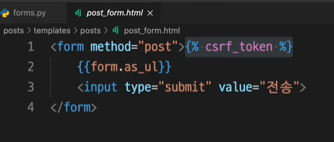
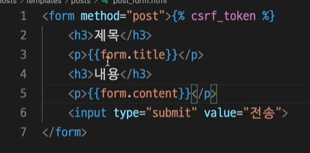
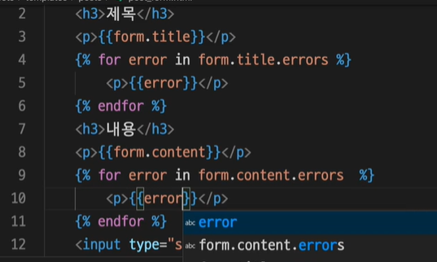
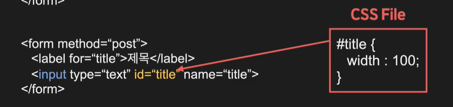
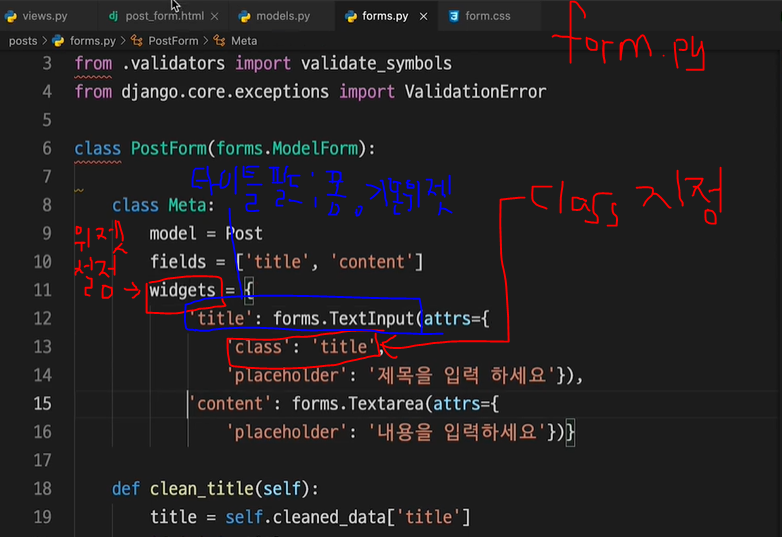

# HTML Form

폼은 웹 페이지에서 사용자의 데이터를 입력받을 수 있는 입력 양식을 말합니다. 아래에서 배우는 여러 Form 요소들은 Django에서 제공하는 폼을 사용하면 저절로 생성되지만 기본적인 HTML 폼을 알고 있으면 Django의 폼을 이해하는데 많은 도움이 됩니다.


## Seperate Form



# ↓







## Widget custom

if you use normal form





기본 위젯은 필드마다 다르다


## label과 input

폼은 form태그 안에 사용자의 입력을 받는 input태그와 설명을 위한 label태그의 쌍으로 구성됩니다.

```html
<form>
    <lable>이름</lable>
    <input type="text">
</form>
```


## for & id

각각의 input태그와 label태그를 묶어주기 위해서 label태그에는 for 속성, input태그에는 id가 사용됩니다.

```html
<form>
    <label for="title">제목</label>
    <input type="text" id="title">
</form>
```

만약 여기에서 for와 id 속성을 적어주고 싶지 않다면 label 태그로 input태그를 감싼 형태를 사용하면 됩니다.

```html
<form>
    <label>제목
        <input type="text">
    </label>
</form>
```

## name

name은 입력된 데이터를 서버로 전송할 때, 서버에서 각각의 데이터를 구분하기 위한 속성으로 name 속성이 있는 양식 요소만 값이 서버로 전달됩니다.

```html
<form>
    <label for="title">제목</label>
    <input type="text" id="title" name="title">
</form>
```

## type

type은 입력할 값에 따른 유형을 나타내는 속성입니다. 이 type에 따라 사용자가 브라우저에서 값을 입력하는 형식인 위젯(widget)이 달라집니다. 자주 사용되는 type은 아래와 같습니다.

- email

```html
<label for="email">이메일</label>
<input type="email" id="email" name="email">
```


- password

```html
<label for="pwd">비밀번호</label>
<input type="password" id="pwd" name="pwd">
```


- button

```html
<input type="button" value="버튼입니다">
```


- radio

```html
<input type="radio" id="male" name="gender" value="male">
<label for="male">남자</label><br>
<input type="radio" id="female" name="gender" value="female">
<label for="female">여자</label><br>
<input type="radio" id="other" name="gender" value="other">
<label for="other">기타</label>
```


- checkbox

```html
<input type="checkbox" id="lang1" name="lang1" value="Python">
<label for="lang1">파이썬(Python)</label><br>
<input type="checkbox" id="lang2" name="lang2" value="JAVA">
<label for="lang2">자바(JAVA)</label><br>
<input type="checkbox" id="lang3" name="lang3" value="Go">
<label for="lang3">고(Go)</label><br>
```


- date

```html
<label for="birthday">생년월일</label>
<input type="date" id="birthday" name="birthday">
```


- file

```html
<label for="userfiles">파일선택</label>
<input type="file" id="userfiles" name="userfiles" multiple>
```


- submit

```html
<input type="submit" value="전송하기"> 
```


## form 속성

form에는 입력된 데이터를 전송할 서버의 URL을 지정하는 action과 http 전달 방식을 지정해 주는 method 속성이 있습니다.

```html
<form action="register" method="post">
    <label for="name">이름</label>
    <input type="text" id="name" name="name">
    <input type="submit" value="제출하기">
</form>
```

## GET과 POST

GET 방식으로 지정하면 유저가 데이터를 입력하고 전송했을 때 URL 뒤에 쿼리 스트링(Query String) 형태로 데이터가 전달됩니다.

```html
<form action="/register" method="get">
    <label for="name">이름</label>
    <input type="text" id="name" name="name">
    <label for="email">이메일</label>
    <input type="email" id="email" name="email">
    <input type="submit" value="제출하기">
</form>
```

```html
http://www.codeit-django.com/register?name=우재&email=woojae@codeit.kr
```

POST 방식은 전송되는 URL에는 표시되지 않고 서버로 전송하는 메세지 안쪽에 데이터를 넣어서 전달합니다. 이 부분에 대해서는 조금 더 나중에 자세하게 다루겠습니다.

```html
<form action="/register" method="post">
    <label for="name">이름</label>
    <input type="text" id="name" name="name">
    <label for="email">이메일</label>
    <input type="email" id="email" name="email">
    <input type="submit" value="제출하기">
</form>
```

```html
http://www.codeit-django.com/register
```

그러면 언제 GET을 사용하고 언제 POST를 사용해야 할까요? 그것을 결정하는 것은 이 요청이 무엇을 하는지에 달려 있습니다. GET은 가져오다는 의미처럼 서버에서 데이터를 가져오는 요청을 보낼 때 사용하고 그 외에 서버의 데이터를 변경하거나 다른 로직을 수행할 때는 POST를 사용합니다. 간단히 정리하면 form을 사용할 때는 사용자로부터 데이터를 입력받아서 저장, 수정 등의 데이터베이스와 관련된 로직을 많이 수행하죠? 그렇기 때문에 form에서는 대부분의 경우 POST를 사용한다고 생각하면 됩니다.
