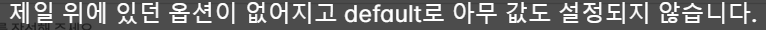

# HTML Form

폼은 웹 페이지에서 사용자의 데이터를 입력받을 수 있는 입력 양식을 말합니다. 아래에서 배우는 여러 Form 요소들은 Django에서 제공하는 폼을 사용하면 저절로 생성되지만 기본적인 HTML 폼을 알고 있으면 Django의 폼을 이해하는데 많은 도움이 됩니다.

## Seperate Form


# ↓


## Widget custom

if you use normal form


기본 위젯은 필드마다 다르다

## label과 input

폼은 form태그 안에 사용자의 입력을 받는 input태그와 설명을 위한 label태그의 쌍으로 구성됩니다.

```html
<form>
    <lable>이름</lable>
    <input type="text">
</form>
```


## for & id

각각의 input태그와 label태그를 묶어주기 위해서 label태그에는 for 속성, input태그에는 id가 사용됩니다.

```html
<form>
    <label for="title">제목</label>
    <input type="text" id="title">
</form>
```

만약 여기에서 for와 id 속성을 적어주고 싶지 않다면 label 태그로 input태그를 감싼 형태를 사용하면 됩니다.

```html
<form>
    <label>제목
        <input type="text">
    </label>
</form>
```

## name

name은 입력된 데이터를 서버로 전송할 때, 서버에서 각각의 데이터를 구분하기 위한 속성으로 name 속성이 있는 양식 요소만 값이 서버로 전달됩니다.

```html
<form>
    <label for="title">제목</label>
    <input type="text" id="title" name="title">
</form>
```

## type

type은 입력할 값에 따른 유형을 나타내는 속성입니다. 이 type에 따라 사용자가 브라우저에서 값을 입력하는 형식인 위젯(widget)이 달라집니다. 자주 사용되는 type은 아래와 같습니다.

- email

```html
<label for="email">이메일</label>
<input type="email" id="email" name="email">
```


- password

```html
<label for="pwd">비밀번호</label>
<input type="password" id="pwd" name="pwd">
```


- button

```html
<input type="button" value="버튼입니다">
```


- radio

```html
<input type="radio" id="male" name="gender" value="male">
<label for="male">남자</label><br>
<input type="radio" id="female" name="gender" value="female">
<label for="female">여자</label><br>
<input type="radio" id="other" name="gender" value="other">
<label for="other">기타</label>
```


- checkbox

```html
<input type="checkbox" id="lang1" name="lang1" value="Python">
<label for="lang1">파이썬(Python)</label><br>
<input type="checkbox" id="lang2" name="lang2" value="JAVA">
<label for="lang2">자바(JAVA)</label><br>
<input type="checkbox" id="lang3" name="lang3" value="Go">
<label for="lang3">고(Go)</label><br>
```


- date

```html
<label for="birthday">생년월일</label>
<input type="date" id="birthday" name="birthday">
```


- file

```html
<label for="userfiles">파일선택</label>
<input type="file" id="userfiles" name="userfiles" multiple>
```


- submit

```html
<input type="submit" value="전송하기"> 
```


## form 속성

form에는 입력된 데이터를 전송할 서버의 URL을 지정하는 action과 http 전달 방식을 지정해 주는 method 속성이 있습니다.

```html
<form action="register" method="post">
    <label for="name">이름</label>
    <input type="text" id="name" name="name">
    <input type="submit" value="제출하기">
</form>
```

## GET과 POST

GET 방식으로 지정하면 유저가 데이터를 입력하고 전송했을 때 URL 뒤에 쿼리 스트링(Query String) 형태로 데이터가 전달됩니다.

```html
<form action="/register" method="get">
    <label for="name">이름</label>
    <input type="text" id="name" name="name">
    <label for="email">이메일</label>
    <input type="email" id="email" name="email">
    <input type="submit" value="제출하기">
</form>
```

```html
http://www.codeit-django.com/register?name=우재&email=woojae@codeit.kr
```

POST 방식은 전송되는 URL에는 표시되지 않고 서버로 전송하는 메세지 안쪽에 데이터를 넣어서 전달합니다. 이 부분에 대해서는 조금 더 나중에 자세하게 다루겠습니다.

```html
<form action="/register" method="post">
    <label for="name">이름</label>
    <input type="text" id="name" name="name">
    <label for="email">이메일</label>
    <input type="email" id="email" name="email">
    <input type="submit" value="제출하기">
</form>
```

```html
http://www.codeit-django.com/register
```

그러면 언제 GET을 사용하고 언제 POST를 사용해야 할까요? 그것을 결정하는 것은 이 요청이 무엇을 하는지에 달려 있습니다. GET은 가져오다는 의미처럼 서버에서 데이터를 가져오는 요청을 보낼 때 사용하고 그 외에 서버의 데이터를 변경하거나 다른 로직을 수행할 때는 POST를 사용합니다. 간단히 정리하면 form을 사용할 때는 사용자로부터 데이터를 입력받아서 저장, 수정 등의 데이터베이스와 관련된 로직을 많이 수행하죠? 그렇기 때문에 form에서는 대부분의 경우 POST를 사용한다고 생각하면 됩니다.

---

# Form in HTML


```bash
pip install django-widget-tweaks
```

```python
# settings.py
INSTALLED_APPS [ 
    ...
    'widget_tweaks'
    ...
]
```

```html
<!-- template -->



{{ form.email |add_class:"asdf" |attr:"placeholder:email" 
    |add_error_class:"error" }}


    <div class="error-message">{{ error }}</div>



<!-- css -->
.asdf input {
 ...
}
.asdf.error {
  ...
}

.error-message {
  ...
}
```


 

---

## Radiobutton Form & Choices


```html
<!-- template -->





<form class="--" method="post" autocomplete="off">
    
    {{ form.rating }}
</form>
```




```html
<!-- template -->




<form class="--" method="post" autocomplete="off">
    
    
        {{ radio }}
    
</form>
```


```html
<!-- template -->




<form class="--" method="post" autocomplete="off">
    
    
        {{ radio }}
    
    
    
        <div class="...">{{ error}}</div>
    
</form>
```

---

## Media Form


```html
<!-- template -->



<form class="--" method="post" autocomplete="off"
     enctype="multipart/form-data">
    
    {{ form.image }}
</form>
```

---

input 태그에는 여러 속성이 사용됩니다. 예를 들어 제공되는 singnup.html 템플릿에는 아래와 같은 input 태그가 있었는데요.

```html
<input type="email" name="email" placeholder="이메일" autocomplete="email" class="cp-input" required id="id_email">

<input type="text" name="nickname" maxlength="15" placeholder="닉네임 (Coplate에서 사용되는 이름입니다)" class="error cp-input" required id="id_nickname">

<input type="password" name="password1" placeholder="비밀번호" autocomplete="new-password" class="cp-input" required id="id_password1">

<input type="password" name="password2" placeholder="비밀번호 확인" class="cp-input" required id="id_password2">
```

### `type`

필드에 들어가는 데이터 유형을 뜻합니다. 모델 폼을 사용하면 모델 필드의 종류에 따라 `type` 이 설정됩니다. (예: `CharField` - `type="text"`, `URLField` - `"type=url"`, `IntegerField` - `type="number"`, `ImageField` - `type="file"`)

`type`에 따라 사용되는 HTML 폼 필드가 결정되고 입력되는 데이터에 대한 유효성 검사도 진행됩니다. 예를 들어 `"type=url"`인 경우 일반 텍스트 필드가 사용되는데, 여기에 유효한 URL을 넣지 않으면 폼을 submit(서버에 전달) 할 수 없습니다. 참고로 이런 유효성 검사는 서버 측에서 진행되는 유효성 검사와 다릅니다. 유효하지 않은 데이터는 아예 서버 쪽으로 전달되는 것을 막기 위해서 클라이언트, 즉 웹 브라우저 측에서도 어느 정도의 유효성 검사를 해 줍니다. 하지만 클라이언트 측에서 진행할 수 없는 유효성 검사도 있는데요. 예를 들어 어떤 값의 중복 여부를 확인하려면 데이터베이스에 있는 값들과 비교를 해야 하기 때문에 클라이언트 측에서 확인할 수 없습니다.

### `name`

폼 데이터가 서버로 전송될 때 사용되는 이름인데, django 폼을 사용하면 자동으로 설정되기 때문에 크게 신경 쓰지 않으셔도 됩니다.

### `placeholder`

HTML 폼 필드 안에 디스플레이되는 텍스트입니다. Django 폼을 사용하면 기본적으로 django 필드의 이름이 사용됩니다. (그래서 우리는 widget-tweaks 패키지를 사용해서 placeholder 속성을 바꿔주었죠?)

### `maxlength`

입력받는 값의 최대 길이를 제한합니다. 이것도 클라이언트 측에서 진행되는 유효성 검사의 일부라고 볼 수 있는데요. 모델 폼을 사용하면 `CharField`의 `max_length` 값에 따라 자동으로 설정됩니다.

### `autocomplete`

브라우저는 기본적으로 input 태그에 입력되는 값들을 기억합니다. autocomplete(자동완성) 기능은 HTML 폼 필드에 값을 입력할 때, 과거에 비슷한 필드에 입력했던 값을 제안해 주는 기능입니다. autocomplete 속성은 form 태그에도 있고, input 태그에도 있는데 autocomplete 속성의 디폴트 값은 "on"이고 input 태그의 autocomplete 속성이 더 우선순위가 높습니다. 그러니까 form 태그와 안에 있는 input 태그에 둘 다 autocomplete 속성이 정의돼 있으면 input 태그의 autocomplete 속성이 사용되는 거죠. (form 태그에는 autocomplete 속성이 있고 input 태그에는 없는 경우 form 태그의 autocomplete 속성이 사용됩니다.)

form 태그의 autocomplete 속성에는 "on"(자동완성 기능을 사용함), "off"(자동완성 기능을 사용하지 않음) 두 가지 옵션이 있고, input 태그의 autocomplete 속성에는 "on", "off" 외에도 많은 옵션이 있습니다. 예를 들어 위 코드를 보시면 `autocomplete="email"`, `autocomplete="new-password"`같이 다양한 값이 사용되는 걸 확인하실 수 있을 텐데요. 다양한 속성을 통해 브라우저한테 어떤 정보에 대한 자동완성을 원하는지 전달해 줄 수 있습니다. 예를 들어 `autocomplete="email"`을 사용하면 이메일 주소만 제안해 줍니다. 여러 autocomplete 옵션에 대한 설명은 이 [링크](https://developer.mozilla.org/ko/docs/Web/HTML/Attributes/autocomplete)를 참고하세요.

참고로 요즘은 로그인을 할 때 브라우저가 ID와 비밀번호를 기억했다가 자동으로 입력해 주죠?


이건 자동완성 중에서도 조금 특별한 기능이고 로그인 필드에서는 autocomplete을 꺼도 이 기능이 항상 사용됩니다. 이 점 유의해 주세요.

### `class`

디자인 (CSS)를 위한 속성입니다. Django가 만들어 주는 input 태그에는 class 속성이 포함되지 않습니다.

### `required`

HTML 폼 필드를 비워놓을 수 없게 하는 속성입니다. 이것도 클라이언트 측에서 진행되는 유효성 검사의 일부라고 볼 수 있는데요. Django 모델/폼 필드를 필수로 정의해 주면 required 속성이 저절로 추가됩니다.

### `id`

일반적으로 id는 HTML 요소를 (CSS나 JavaScript로) 선택할 수 있게 해 줍니다. id 속성도 django 폼을 사용하면 자동으로 설정되기 때문에 크게 신경 쓰지 않으셔도 됩니다.

Django 폼을 렌더하는 작업은 항상 까다롭고 헷갈릴 수 있는데요. 먼저 `{{ form.field }}` 형태로 폼 필드를 렌더한 다음, 개발자 도구로 어떤 속성이 설정되는지를 파악하고 widget-tweaks를 사용해서 속성을 추가하거나 수정해 보세요!

---

### non-field error


```html
<form method="post">
    
    
        <div class="form-error error-message">
            {{ error }}
        </div>
    
    ...
</form>
```

---

## Overall

```html



<form class="aa" method="post" autocomplete="off">
    
    
        <div class="form-error error-message">
            {{ error }}
        </div>
    
    {{ form.title|add_class:"..."|attr:"placeholder:..."}}
    
        <div class="...">{{ errir }}</div>
    
</form>
```
