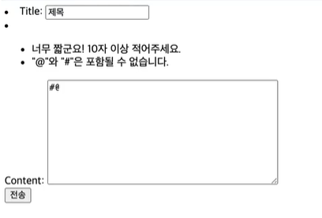

# Is valid Form?

## How to valid by Model Field

In field title, unique option make valid data


## How to valid by Validator


make new file validator.py





## How to valid in form

example >>


# 유효성 검증을 뒤늦게 추가했다면?


make new file **validate_data.py**

we'll make function for check and modify data

```python
# validate_data.py

from .models import {YourModel}

def validate_post():
    # 1. bring all data
    models = {YourModel}.objects.all()

    # 2. check that exist '&' in your model data
    for model in models:
        if '&' in model.{yourfield}:
            # 3. if exist '&' in data, delete '&'
            post.{yourfield} = post.{yourfield}.replace('&', '')

            # 4. save the data
            post.save()

    # if modified day is earlier than created day
    if model.dt_modified < model.dt_created:
        model.save()
        # dt_modified will be present
```


In **terminal**

```bash
python manage.py shell


from {app_name}.validate_data import validate_post


validate_post()

exit()
```
