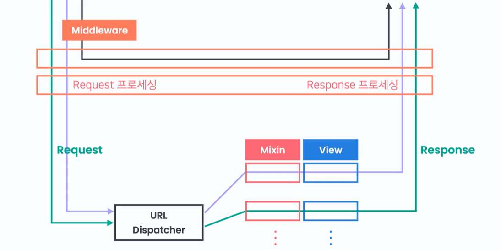
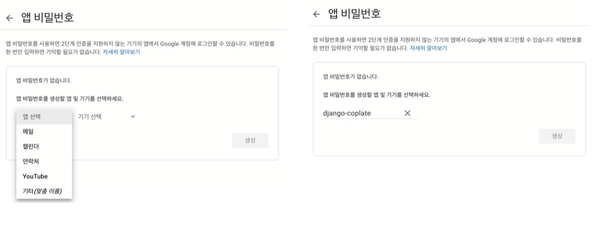

# Middleware

미들웨어는 request와 response 사이클을 제어해준다

미들웨어는 mixin처럼 뷰 하나에만 적용되는 것이 아니라 뷰 컴포넌트 전체에 적용된다 request는 url Dispatcher에 도착하기도 전에 항상 미들웨어를 통과하기 때문에 다양한 로직을 넣을 수 있다

미들웨어는 리퀘스트를 url  디스패치에 넣어주거나 바로 리스폰스를 돌려줄 수 있다

미들웨어는 리퀘스트를 다음 컴포넌트에 그대로 전달하는 것이 아니라 리퀘스트를 프로세싱해준 다음 전달할 수 있다
예를 들어 리퀘스트에 추가 정보를 더한다든가 리퀘스트의 정보를 수정할 수 있는 것
뷰에서 리턴되는 리스폰스도 모드 미들웨어를 거치게 되는데, 리퀘스트를 프로세싱하는 것처럼 리스폰스도 프로세싱 해줄 수 있다




프로젝트의 세팅 파일을 보면 미들웨어 세팅이 있는데, 뷰에서 현재 유저를 request.user로 접근할 수 있는 이유가 AuthenticationMiddleaware(이하 인증미들웨어)가 request에 현재 user라는 속성을 부여하기 때문
전체적인 request에 대한 로직은 미들웨어 에서 구현한다
여러개의 미들웨어를 통과하는 순서는 리퀘스트는 위에서부터 아래로
리스폰스는 아래부터 위로 통과한다
중간에 다음 미들웨어로 넘어가는 대신 어떤 리스폰스가 리턴 될 수 있다




우리는 프로필 설정 하지 않았으면 항상 프로필 설정 페이지로 리디렉트 하고 싶다 =>  url 과 상관없이 리디렉트를 하고 싶은 것이기 때문에 미들웨어를 사용해야 하는 것

앱 안에 middleware.py  파일을 만든 후 미들웨어를 정의할건데
    -   [Django docs: Middleware](https://docs.djangoproject.com/en/2.2/topics/http/middleware/)
여기에서 클래스형 미들웨어를 복붙해서 정의하기 위한 틀을 만들어준다

```python
from django.urls import reverse
from django.shortcuts import redirect

class ProfileSetupMiddleware:
    def __init__(self, get_response):
        self.get_response = get_response
        # One-time configuration and initialization.

    def __call__(self, request):
        # Code to be executed for each request before
        # the view (and later middleware) are called.
        # 리퀘스트를 프로세싱 해주는 코드는 여기에
        if (
            request.user.is_authenticated and # 로그인되있는지
            not request.user.nickname and # 프로필설정했는지
            request.path_info != reverse('profile-set') 
            # 유저가 어디로 리퀘스트 보냈는지
        ):
            return redirect("profile-set")
        response = self.get_response(request)

        # Code to be executed for each request/response after
        # the view is called.

        return response
# 코드를 작성했으니 세팅에 등록해준다

# settings.py
MIDDLEWARE = [
    ...
    "django.contrib.auth.middleware.AuthenticationMiddlewre"
    ...
    "coplate.middleware.ProfileSetupMiddleware",
]
# 우리가 등록해준 미들웨어는 인증미들웨어 이후에 써야 하는데 왜냐면 우리는 인증미들웨어를 거쳐야 설정되기 때문임
```
