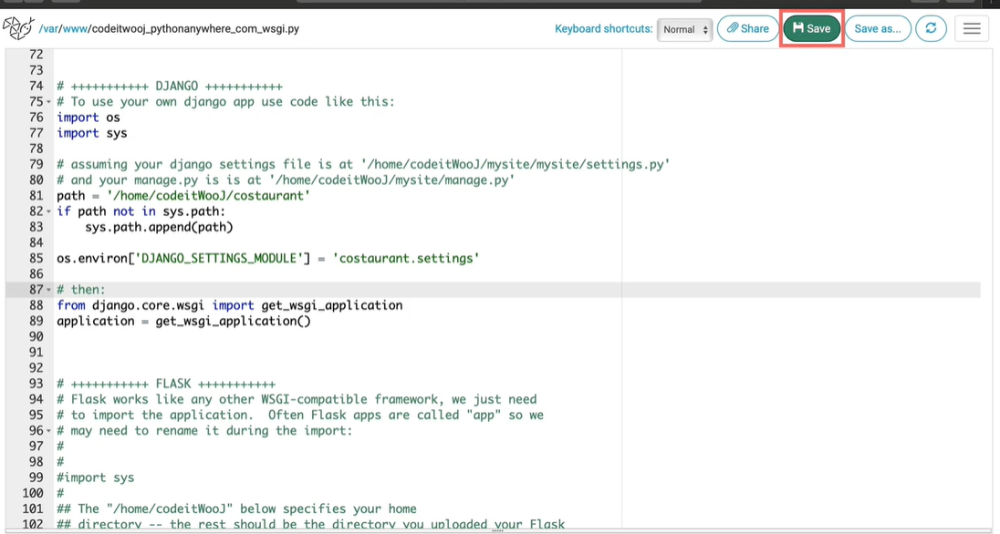
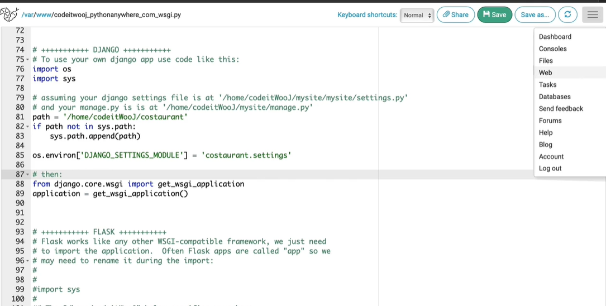

# Paas


## 1. off debug

```python
# setting.py

DEBUG = False
```

## 2.  setting Host

write this code

```python
# setting.py

ALLOWED_HOSTS = ['.pythonanywhere.com']
```

## 2. collect static file

write this code

```python
# setting.py

STATIC_ROOT = os.path.join(BASE_DIR, 'static')
```


```terminal
# terminal

python manage.py collectstatic
```

       =>             

## 4. make project file to zip file

## 5. python anywhere sign up and upload

https://www.pythonanywhere.com/


project.zip file upload


then it will open console

write this

```bash
unzip yourfilename.zip
virtualenv --python=python3.7 venv
cd venv
. venv/script/active
pip install django==3.23
```


push next 


select your python version, and push next


click

line 19 ~ line 47 comment out


line 76 - line 89 uncomment


line 81 


line 85


click save



and click web



find Virtualenv


go to up


