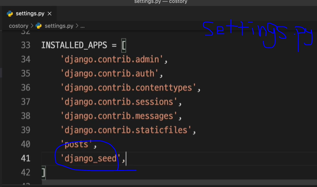

# Seeding


```bash
python manage.py dumpdata {app_name} > {filenameyouwant}.json
```


```bash
python manage.py dumpdata 
    {app_name} --indent=2 > {filenameyouwant}.json

# one line
```


makefile


```bash
python manage.py loaddata {filenameyouwant}.json
```


# More data

```bash
pip install django-seed==0.2.2
```



```bash
python manage.py seed {app_name} --number=50
```


