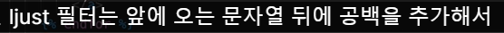
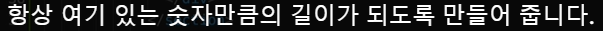
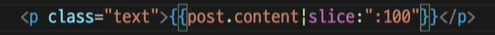
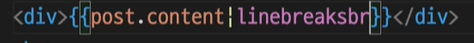

# Template Language 한 걸음 더

템플릿 언어 (Template Language)는 Django의 템플릿에서 사용 할 수 있는 특별한 문법으로 템플릿 변수, 템플릿 필터, 템플릿 태그, 템플릿 코멘트가 있습니다. 이번 노트에서는 템플릿 변수와 필터 그리고 태그에 대해 조금 더 알아볼텐데 아래 내용을 모두 외우려고 하지 말고 '이런 식으로 사용하는구나' 정도로만 가볍게 읽어보세요!

# 템플릿 변수 (Template Variable)

```html
{{ variable }}
```

템플릿 변수는 템플릿이 렌더될 때 해당 변수가 의미하는 값으로 변환됩니다. 뷰(View)에서 가공한 데이터를 템플릿으로 넘겨주면 템플릿에서는 템플릿 변수를 사용해 넘겨받은 데이터에 접근할 수 있습니다.

## 템플릿 변수의 점(.) 연산자

템플릿 변수는 점(.)을 사용해서 변수 안쪽 속성에 접근할 수 있습니다.

```python
user = {"name" : "우재", "coffee" : True}
```

예를 들어 위와 같은 user 변수가 있다면, `user.name`으로 "우재"라는 안쪽 값에 접근 할 수 있다는 거죠. 이와 같은 점(.) 연산자는 다음과 같은 `순서`로 변수의 안쪽 속성에 접근을 시도합니다.

1. 변수를 `사전형(dict)`으로 생각하고 점(.) 연산자로 Key값 조회
2. 변수를 `객체`로 생각하고 내부 속성값 조회 또는 함수 호출
3. 변수를 `리스트(list)`로 생각하고 점(.) 연산자로 Index 조회

Django에서 템플릿의 점 연산자를 만나면 자동으로 위의 경우대로 순서대로 처리하며 알맞은 값으로 변환되지만 내가 접근 하려는 템플릿 변수가 어떤 자료형인지 알고 점(.)연산자를 사용해야지만 예기치 못한 에러를 방지 할 수 있습니다.

# 템플릿 필터 (Template Filter)

```html
{{ variable|filter }}
```

템플릿 변수에 파이프(|)를 쓰고 템플릿 필터를 사용하면 템플릿 변수를 특정 형식으로 변환 할 수 있습니다.

```html
{{ variable|filter:args }}
```

일부 필터는 필터 뒤에 인자를 필요로 합니다. Django는 약 60개의 내장 템플릿 필터를 제공하며 개발자가 직접 필터를 정의해서 사용하는 것도 가능합니다. 아래는 몇 가지 내장 템플릿 필터입니다.

### **default**

참조하는 템플릿 변수가 비어 있거나 불린형 False일 경우 변환되는 값을 지정합니다.

```
{{ variable|default:"coffee" }} 
```

변수가 비어 있거나 False면 coffee 라는 텍스트로 대체 됩니다.

### **capfirst**

맨 첫글자를 대문자로 바꿔 줍니다.

```
{{ variable|capfirst }}
```

### **random**

반복 가능한 템플릿 변수에 대해 무작위로 하나를 추출해 변환합니다.

```
{{ variable|random }}
```

만약 variable이 참조하는 값이 [ "a", "b", "c", "d" ] 인 리스트형이라면 템플릿 변수가 리스트 내의 하나의 원소로 대체 됩니다.

### **upper & lower**

템플릿 변수를 대문자(upper) 또는 소문자 (lower)로 변환합니다.

```
{{ variable | upper }} , {{ variable | lower }}
```

### **ljust & rjust**

주어진 길이 내에서 공백을 넣어 왼쪽 정렬(ljust) 또는 오른쪽 정렬(rjust)을 한 문자열로 변환합니다.

```
{{ variable|ljust:"length" }}, {{ variable|rjust:"length" }}
```

variable이 "codeit" 일 때 {{ variable|ljust:"10" }} 이라면 "codeit "이 됩니다. 공백을 표시해서 보면 "codeit_ _ _ _"이런 형태인거죠.마찬가지로 만약 {{ variable|rjust:"10" }} 이라면 " codeit"이 되겠죠?

이 밖에도 몇 가지 필터가 더 있는데 모두 외울 필요는 당연히 없고 필요할 때 찾아서 사용하면 됩니다. 더 많은 템플릿 필터에 대한 정보는 아래 Django 공식 문서를 참고하세요. [Built-in template tags and filters | Django documentation | Django](https://docs.djangoproject.com/en/2.2/ref/templates/builtins/#ref-templates-builtins-filters)

# 템플릿 태그 (Template Tag)

```html

```

템플릿 태그는 템플릿을 작성할 때 반복문, 조건문 등의 로직을 사용해서 마치 프로그래밍을 하듯 템플릿을 작성할 수 있게 해줍니다. Django가 기본적으로 제공하는 태그가 있지만, 개발자가 직접 태그를 정의해서 사용할 수도 있습니다.

```html
 ~ 
```

태그의 형태는 단독으로 사용하는 템플릿 태그와 여는 태그와 닫는 태그가 필요한 템플릿 태그가 있습니다. 아래는 몇 가지 기본 템플릿 태그입니다.

### **for**

```
 ~ 
```

반복 가능한 객체를 반복하며 템플릿을 작성 할 수 있습니다. 아래처럼 말이죠.

```html
 
    <li> {{ food.name }} </li>

```

만약 목록을 역순으로 반복하고 싶다면 아래와 같이 사용 할 수 있습니다.

```html
 
    <li> {{ food.name }} </li>

```

반복 가능한 객체가 비어 있거나 존재하지 않을 때는 아래와 같이 사용 할 수 있습니다.
아래는 만약 foods라는 객체가 비어있다면  구문이 실행됩니다.

```html
 
    <li> {{ food.name }} </li>

    <li> There is no food. </li>

```

### **if**

```
 ~  ~  ~ 
```

파이썬에서 사용하던 조건문과 형태가 비슷하죠? 실제로 사용 할 때도 우리가 아는 조건문의 형태로 사용하면 됩니다.

```html

    <p> Let's eat! </p>

        <p> You need some coffee. </p>

    <p> Go back to work. </p>

```

### **with**

```
 ~ 
```

복잡한 변수가 있을 때 '별명'을 붙이기 위해 사용합니다. with 구문 내에서는 value1을 value2 대신 사용할 수 있습니다.

### **ljust**

지정된 너비의 필드에서 값을 왼쪽 정렬합니다.

**인수:** 필드 크기

```html
☆
```



이 밖에도 몇 가지 템플릿 태그가 더 있는데, 필터와 마찬가지로 필요할 때 찾아서 사용하면 됩니다. 템플릿 태그에 대한 더 많은 정보는 아래 Django 공식 문서를 참고하세요. [Built-in template tags and filters | Django documentation | Django](https://docs.djangoproject.com/en/2.2/ref/templates/builtins/#ref-templates-builtins-tags)

# 사용자 정의 필터와 태그

사용자 정의 템플릿 필터와 템플릿 태그를 사용하는 방법은 Django의 문법에 익숙해진 후에 별도의 레슨에서 다루도록 하겠습니다. 지금은 기본적인 템플릿 언어에 익숙해지는 것이 중요합니다. 만약 먼저 알고 싶다면 아래의 공식 문서를 참고하세요. [Custom template tags and filters | Django documentation | Django](https://docs.djangoproject.com/en/2.2/howto/custom-template-tags/)

## slice



you can see only 100 word

## linebreaksbr



if it doesn't work /n(=enter), should use it
