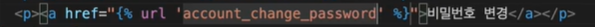
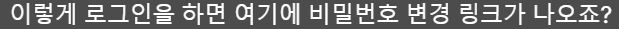
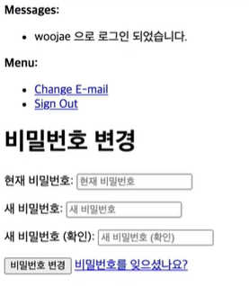

# User

##### contrib

```python
django.contrib
```


##### authentication


##### admin


##### staticfiles


## django.contrib.auth


## django-allauth


```python
# models.py

from django.db import models
from django.contrib.auth.models. import AbstractUser

class User(AbstractUser):
    pass
```

```python
# setting.py
AUTH_USER_MODEL = 'app_name.User'
```


```python
# admin.py

from django.contrib import admin
from django.contrib.auth.admin import UserAdmin
from .models import User

# originally this is right but user is different 
admin.site.register(User)

# write this
adin.site.register(User, UserAdmin)
```


---

# django-allauth

- [allauth 설치 가이드](https://django-allauth.readthedocs.io/en/latest/index.html)


 

 

   


**setting.py**


**setting.py**    


```python
# admin.py

from django.contrib import admin
from django.contrib.auth.admin import UserAdmin
from .models import User

# write this
adin.site.register(User, UserAdmin)
UserAdmin.fieldsets += ("Custom fields", {"fields" : ("nickname",)})
```


---

# Signup Form Custom


**forms.py**


 

---

# Velidation

**setting.py**            


---

## Password velidator


```python
def contains_uppercase_letter(value):
    for char in value:
        if char.isupper():
            return True
    return False

def contains_lowercase_letter(value):
    for char in value:
        if char.islower():
            return True
    return False

def contains_number(value):
    for char in value:
        if char.isdigit():
            return True
    return False
```


---


---

# Email velidation


## 1. ACCOUNT_EMAIL_VERIFICATION


Sign up and


---

# Password





```python
# views.py
from allauth,account.views import PasswordChangeView
from django.urls import reverse

class CustomPasswordChangeView(PasswordChangeView):
    def get_success_url(self):
        return reverse("index")
```


자주 사용되는 allauth URL입니다. 참고하세요!

| URL 경로                    | URL 네임                                 | 설명                                                                                                                                                                              |
| ------------------------- | -------------------------------------- | ------------------------------------------------------------------------------------------------------------------------------------------------------------------------------- |
| 'signup/'                 | 'account_signup'                       | 회원가입 페이지                                                                                                                                                                        |
| 'login/'                  | 'account_login'                        | 로그인 페이지                                                                                                                                                                         |
| 'logout/'                 | 'account_logout'                       | 로그아웃 페이지 (`ACCOUNT_LOGOUT_ON_GET = True` 사용시 바로 로그아웃 됩니다. `ACCOUNT_LOGOUT_ON_GET`은 settings.py 파일에서 설정합니다. 'allauth 유용한 세팅들 정리' [노트](https://www.codeit.kr/learn/4792)를 참고하세요!) |
| 'confrim-email//'         | 'account_confirm_email'                | 이메일 인증 페이지 (`ACCOUNT_CONFIRM_EMAIL_ON_GET = True` 사용시 바로 인증 완료 됩니다.)                                                                                                            |
| 'password/change/'        | 'account_change_password'              | 비밀번호 변경 페이지                                                                                                                                                                     |
| 'password/reset/'         | 'account_reset_password'               | 비밀번호 찾기 페이지 (비밀번호 재설정 링크를 받을 이메일을 입력하는 페이지)                                                                                                                                     |
| 'password/reset/done/'    | 'account_reset_password_done'          | 비밀번호 재설정 이메일 전송 완료 페이지                                                                                                                                                          |
| 'password/reset/key//     | 'account_reset_password_from_key'      | 비밀번호 재설정 페이지 (새 비밀번호를 설정하는 페이지)                                                                                                                                                 |
| 'password/reset/key/done/ | 'account_reset_password_from_key_done' | 비밀번호 재설정 완료 페이지                                                                                                                                                                 |

`<key>`는 이메일 인증/비밀번호 재설정에 사용되는 코드입니다. 전송되는 이메일에 자동으로 포함됩니다.

allauth의 전용 세팅도 있고, 일반 django의 세팅도 있는데, allauth 전용 세팅은 모두 ACCOUNT로 시작합니다. 모든 세팅은 프로젝트의 settings.py 파일에 추가해 주시면 됩니다.

| 세팅                                                    | 값                                         | 디폴트 값                       | 설명                                                                                                                                                         |
| ----------------------------------------------------- | ----------------------------------------- | --------------------------- | ---------------------------------------------------------------------------------------------------------------------------------------------------------- |
| ACCOUNT_AUTHENTICATION_METHOD                         | "username" \| "email" \| "username_email" | "username"                  | 로그인 방법을 설정합니다. "username": 유저네임 사용, "email": 이메일 사용, "username_email": 둘 다 사용 가능                                                                           |
| ACCOUNT_CONFIRM_EMAIL_ON_GET                          | True \| False                             | False                       | True: 이메일 인증 링크를 클릭하면 바로 인증이 됩니다, False: 이메일 인증 링크를 클릭하면 인증 confirmation 페이지로 갑니다.                                                                         |
| ACCOUNT_EMAIL_CONFIRMATION_ANONYMOUS_REDIRECT_URL     | URL (URL 경로, URL 네임 모두 가능)                | LOGIN_URL (아래 참고)           | 로그인이 안된 상태로 인증을 완료했을 때 리디렉트되는 URL.                                                                                                                         |
| ACCOUNT_EMAIL_CONFIRMATION_AUTHENTICATED_REDIRECT_URL | URL (URL 경로, URL 네임 모두 가능)                | LOGIN_REDICRECT_URL (아래 참고) | 로그인이 된 상태로 인증을 완료했을 때 리디렉트되는 URL.                                                                                                                          |
| ACCOUNT_EMAIL_CONFIRMATION_EXPIRE_DAYS                | 이메일 인증 링크 만료 기간 (단위: 일)                   | 3                           | 이메일 인증 링크 만료 기간                                                                                                                                            |
| ACCOUNT_EMAIL_REQUIRED                                | True \| False                             | False                       | 회원가입 시 이메일을 꼭 입력해야 하는지를 결정합니다. True: 이메일을 꼭 입력해야 합니다, False: 이메일 필드는 옵셔널 필드입니다.                                                                            |
| ACCOUNT_EMAIL_VERIFICATION                            | "mandatory" \| "optional" \| "none"       | "optional"                  | 이메일 인증 필요 여부를 설정합니다. "mandatory": 회원가입 시 인증 이메일이 발송되고, 인증을 완료해야만 로그인을 할 수 있습니다, "optional": 회원가입 시 인증 이메일이 발송되지만, 인증이 필수는 아닙니다, "none": 인증 이메일이 발송되지 않습니다. |
| ACCOUNT_LOGIN_ATTEMPTS_LIMIT                          | 최대 로그인 실패 횟수                              | 5                           | 최대 로그인 실패 횟수                                                                                                                                               |
| ACCOUNT_LOGIN_ATTEMPTS_TIMEOUT                        | 로그인이 잠기는 기간 (단위: 초)                       | 300                         | 로그인 시도가 ACCOUNT_LOGIN_ATTEMPTS_LIMIT을 초과하면 설정하는 시간만큼 로그인이 잠깁니다.                                                                                            |
| ACCOUNT_LOGOUT_ON_GET                                 | True \| False                             | False                       | True: 로그아웃 링크를 클릭하면 바로 로그아웃이 됩니다, False: 로그아웃 링크를 클릭하면 로그아웃 confirmation 페이지로 갑니다.                                                                         |
| ACCOUNT_LOGOUT_REDIRECT_URL                           | URL (URL 경로, URL 네임 모두 가능)                | "/"                         | 로그아웃 시 리디렉트되는 URL                                                                                                                                          |
| ACCOUNT_PASSWORD_INPUT_RENDER_VALUE                   | True \| False                             | False                       | 폼 유효성 검사를 실패할 경우, 입력했던 비밀번호가 채워진 상태로 폼이 돌아오는지를 설정합니다.                                                                                                      |
| ACCOUNT_SESSION_REMEMBER                              | None \| True \| False                     | None                        | 브라우저를 닫으면 유저를 로그아웃 시킬지를 결정합니다. None: 유저가 체크박스를 통해 선택하게 합니다, True: 브라우저를 닫아도 로그인을 유지합니다, False: 브라우저를 닫으면 유저를 로그아웃 시킵니다.                                    |
| ACCOUNT_SIGNUP_EMAIL_ENTER_TWICE                      | True \| False                             | False                       | 회원가입시 이메일을 두 번 입력해야 하는지를 설정합니다.                                                                                                                            |
| ACCOUNT_SIGNUP_FORM_CLASS                             | 폼 클래스 (e.g. 'myapp.forms.SignupForm')     | None                        | 회원가입 페이지에서 추가 정보를 받아야 할 때, 사용할 폼 클래스를 지정해 줍니다.                                                                                                             |
| ACCOUNT_SIGNUP_PASSWORD_ENTER_TWICE                   | True \| False                             | False                       | 회원가입 시 비밀번호를 두 번 입력해야 하는지를 설정합니다.                                                                                                                          |
| ACCOUNT_SIGNUP_REDIRECT_URL                           | URL (URL 경로, URL 네임 모두 가능)                | LOGIN_REDIRECT_URL (아래 참고)  | 회원가입 성공 시 리디렉트되는 URL                                                                                                                                       |
| ACCOUNT_USERNAME_REQUIRED                             | True \| False                             | True                        | 회원가입 시 유저네임을 입력해야 하는지를 결정합니다. True: 유저네임을 입력해야 합니다, False: 유저네임을 입력받지 않습니다.                                                                                |
| LOGIN_REDIRECT_URL                                    | URL (URL 경로, URL 네임 모두 가능)                | '/accounts/profile/'        | 성공적인 로그인 시 리디렉트되는 URL                                                                                                                                      |
| LOGIN_URL                                             | URL (URL 경로, URL 네임 모두 가능)                | '/accounts/login/'          | 웹사이트의 로그인 URL (이 [영상](https://www.codeit.kr/learn/4826)을 참고하세요)                                                                                            |
| PASSWORD_RESET_TIMEOUT                                | 비밀번호 재설정 링크 만료 기간 (단위: 초)                 | 259200 (3일)                 | 비밀번호 재설정 링크 만료 기간 (Django 3.1 이후 버전에서만 지원)                                                                                                                 |
| PASSWORD_RESET_TIMEOUT_DAYS                           | 비밀번호 재설정 링크 만료 기간 (단위: 일)                 | 3                           | 비밀번호 재설정 링크 만료 기간 (Django 3.0 이전 버전에서만 지원)                                                                                                                 |
| SESSION_COOKIE_AGE                                    | 세션 쿠키 만료 기간 (단위: 초)                       | 1209600 (2주)                | 세션 쿠키 만료 기간 (로그인을 얼마나 오랫동안 유지할 것인지)                                                                                                                        |

나머지 세팅들은 링크를 참고하세요!

[Configuration &mdash; django-allauth 0.43.0 documentation](https://django-allauth.readthedocs.io/en/latest/configuration.html)

# Allauth HTML


```bash
pip install django-widget-tweaks
```

```python
# settings.py
INSTALLED_APPS [ 
    ...
    'widget_tweaks'
    ...
]
```

```html
# template 


{{ form.email |add_class:"asdf" |attr:"placeholder:email" 
    |add_error_class:"error" }}


    <div class="error-message">{{ error }}</div>



/* css */
.asdf input {
 ...
}
.asdf.error {
  ...
}

.error-message {
  ...
}
```


 


---

input 태그에는 여러 속성이 사용됩니다. 예를 들어 제공되는 singnup.html 템플릿에는 아래와 같은 input 태그가 있었는데요.

```html
<input type="email" name="email" placeholder="이메일" autocomplete="email" class="cp-input" required id="id_email">

<input type="text" name="nickname" maxlength="15" placeholder="닉네임 (Coplate에서 사용되는 이름입니다)" class="error cp-input" required id="id_nickname">

<input type="password" name="password1" placeholder="비밀번호" autocomplete="new-password" class="cp-input" required id="id_password1">

<input type="password" name="password2" placeholder="비밀번호 확인" class="cp-input" required id="id_password2">
```

### `type`

필드에 들어가는 데이터 유형을 뜻합니다. 모델 폼을 사용하면 모델 필드의 종류에 따라 `type` 이 설정됩니다. (예: `CharField` - `type="text"`, `URLField` - `"type=url"`, `IntegerField` - `type="number"`, `ImageField` - `type="file"`)

`type`에 따라 사용되는 HTML 폼 필드가 결정되고 입력되는 데이터에 대한 유효성 검사도 진행됩니다. 예를 들어 `"type=url"`인 경우 일반 텍스트 필드가 사용되는데, 여기에 유효한 URL을 넣지 않으면 폼을 submit(서버에 전달) 할 수 없습니다. 참고로 이런 유효성 검사는 서버 측에서 진행되는 유효성 검사와 다릅니다. 유효하지 않은 데이터는 아예 서버 쪽으로 전달되는 것을 막기 위해서 클라이언트, 즉 웹 브라우저 측에서도 어느 정도의 유효성 검사를 해 줍니다. 하지만 클라이언트 측에서 진행할 수 없는 유효성 검사도 있는데요. 예를 들어 어떤 값의 중복 여부를 확인하려면 데이터베이스에 있는 값들과 비교를 해야 하기 때문에 클라이언트 측에서 확인할 수 없습니다.

### `name`

폼 데이터가 서버로 전송될 때 사용되는 이름인데, django 폼을 사용하면 자동으로 설정되기 때문에 크게 신경 쓰지 않으셔도 됩니다.

### `placeholder`

HTML 폼 필드 안에 디스플레이되는 텍스트입니다. Django 폼을 사용하면 기본적으로 django 필드의 이름이 사용됩니다. (그래서 우리는 widget-tweaks 패키지를 사용해서 placeholder 속성을 바꿔주었죠?)

### `maxlength`

입력받는 값의 최대 길이를 제한합니다. 이것도 클라이언트 측에서 진행되는 유효성 검사의 일부라고 볼 수 있는데요. 모델 폼을 사용하면 `CharField`의 `max_length` 값에 따라 자동으로 설정됩니다.

### `autocomplete`

브라우저는 기본적으로 input 태그에 입력되는 값들을 기억합니다. autocomplete(자동완성) 기능은 HTML 폼 필드에 값을 입력할 때, 과거에 비슷한 필드에 입력했던 값을 제안해 주는 기능입니다. autocomplete 속성은 form 태그에도 있고, input 태그에도 있는데 autocomplete 속성의 디폴트 값은 "on"이고 input 태그의 autocomplete 속성이 더 우선순위가 높습니다. 그러니까 form 태그와 안에 있는 input 태그에 둘 다 autocomplete 속성이 정의돼 있으면 input 태그의 autocomplete 속성이 사용되는 거죠. (form 태그에는 autocomplete 속성이 있고 input 태그에는 없는 경우 form 태그의 autocomplete 속성이 사용됩니다.)

form 태그의 autocomplete 속성에는 "on"(자동완성 기능을 사용함), "off"(자동완성 기능을 사용하지 않음) 두 가지 옵션이 있고, input 태그의 autocomplete 속성에는 "on", "off" 외에도 많은 옵션이 있습니다. 예를 들어 위 코드를 보시면 `autocomplete="email"`, `autocomplete="new-password"`같이 다양한 값이 사용되는 걸 확인하실 수 있을 텐데요. 다양한 속성을 통해 브라우저한테 어떤 정보에 대한 자동완성을 원하는지 전달해 줄 수 있습니다. 예를 들어 `autocomplete="email"`을 사용하면 이메일 주소만 제안해 줍니다. 여러 autocomplete 옵션에 대한 설명은 이 [링크](https://developer.mozilla.org/ko/docs/Web/HTML/Attributes/autocomplete)를 참고하세요.

참고로 요즘은 로그인을 할 때 브라우저가 ID와 비밀번호를 기억했다가 자동으로 입력해 주죠?


이건 자동완성 중에서도 조금 특별한 기능이고 로그인 필드에서는 autocomplete을 꺼도 이 기능이 항상 사용됩니다. 이 점 유의해 주세요.

### `class`

디자인 (CSS)를 위한 속성입니다. Django가 만들어 주는 input 태그에는 class 속성이 포함되지 않습니다.

### `required`

HTML 폼 필드를 비워놓을 수 없게 하는 속성입니다. 이것도 클라이언트 측에서 진행되는 유효성 검사의 일부라고 볼 수 있는데요. Django 모델/폼 필드를 필수로 정의해 주면 required 속성이 저절로 추가됩니다.

### `id`

일반적으로 id는 HTML 요소를 (CSS나 JavaScript로) 선택할 수 있게 해 줍니다. id 속성도 django 폼을 사용하면 자동으로 설정되기 때문에 크게 신경 쓰지 않으셔도 됩니다.

Django 폼을 렌더하는 작업은 항상 까다롭고 헷갈릴 수 있는데요. 먼저 `{{ form.field }}` 형태로 폼 필드를 렌더한 다음, 개발자 도구로 어떤 속성이 설정되는지를 파악하고 widget-tweaks를 사용해서 속성을 추가하거나 수정해 보세요!

---

### non-field error


```html
<form method="post">
    
    
        <div class="form-error error-message">
            {{ error }}
        </div>
    
    ...
</form>
```

---

## Message_overriding


  


```html
{{ activate_url }}
```


```python
# settings.py
ACCOUNT_EMAIL_SUBJECT_PREFIX = ""
```


allauth의 템플릿 파일을 오버라이드하려면 allauth의 템플릿 파일과 똑같은 이름을 가진 파일을 app_name/templates/account/ 폴더 안에 넣어주시면 됩니다. 그리고 settings.py 파일의 `INSTALLED_APPS` 목록에서 `app_name`은 `allauth`보다 위에 와야 합니다.

# HTML 템플릿

커스텀 템플릿을 app_name/templates/account/ 폴더 안에 넣어주시면 됩니다.

(예: coplate/templates/account/signup.html)

| 페이지                                                  | 템플릿 이름                            | 필드                                                                                                                                                                        |
| ---------------------------------------------------- | --------------------------------- | ------------------------------------------------------------------------------------------------------------------------------------------------------------------------- |
| 회원가입 ('account_signup')                              | signup.html                       | - 유저네임: {{ form.username }}<br>- 이메일: {{ form.email }}<br>- 비밀번호: {{ form.password1 }}<br>- 비밀번호 확인: {{ form.password2 }}<br>- 추가 필드(extra_field): {{ form.extra_field }} |
| 로그인 ('account_login')                                | login.html                        | - 로그인 (유저네임/이메일/둘 다 허용): {{ form.login }}<br>- 비밀번호: {{ form.password }}                                                                                                  |
| 비밀번호 변경 ('account_change_password')                  | password_change.html              | - 현재 비밀번호: {{ form.oldpassword }}<br>- 새 비밀번호: {{ form.password1 }}<br>- 새 비밀번호 확인: {{ form.password2 }}                                                                  |
| 비밀번호 찾기 ('account_reset_password')                   | password_reset.html               | - 이메일: {{ form.email }}                                                                                                                                                   |
| 비밀번호 재설정 이메일 발송 완료 ('account_reset_password_done')   | password_reset_done.html          |                                                                                                                                                                           |
| 비밀번호 재설정 ('account_reset_password_from_key')         | password_reset_from_key.html      | - 새 비밀번호: {{ form.password1 }}<br>- 새 비밀번호 확인: {{ form.password2 }}                                                                                                       |
| 비밀번호 재설정 완료 ('account_reset_password_from_key_done') | password_reset_from_key_done.html |                                                                                                                                                                           |

위 테이블에 있는 필드를 활용해서 템플릿을 만드시면 됩니다.

예: signup.html

```html





회원가입 | Coplate


<div class="account-background">
  <main class="account">
    <div class="title">
      <a href="">
        
      </a>
    </div>

    <form method="post">
      
      <div>
        {{ form.email|add_class:"cp-input"|attr:"placeholder:이메일"|add_error_class:"error" }}
        
          <div class="error-message">{{ error }}</div>
        
      </div>
      <div>
        {{ form.nickname|add_class:"cp-input"|attr:"placeholder:닉네임 (Coplate에서 사용되는 이름입니다)"|add_error_class:"error" }}
        
          <div class="error-message">{{ error }}</div>
        
      </div>
      <div>
        {{ form.password1|add_class:"cp-input"|attr:"placeholder:비밀번호"|add_error_class:"error" }}
        
          <div class="error-message">{{ error }}</div>
        
      </div>
      <div>
        {{ form.password2|add_class:"cp-input"|attr:"placeholder:비밀번호 확인"|add_error_class:"error" }}
        
          <div class="error-message">{{ error }}</div>
        
      </div>
      <button class="cp-button" type="submit">회원가입</button>
    </form>

    <div class="info">
      이미 회원이신가요?<a class="link" href="">로그인</a>
    </div>
  </main>
</div>

```

# 이메일 템플릿

커스텀 템플릿을 app_name/templates/account/email/ 폴더 안에 넣어주시면 됩니다.

(예: coplate/templates/account/email/email_confirmation_signup_subject.txt)

| 설명                                                                          | 템플릿 이름                                | 템플릿 변수                                |
| --------------------------------------------------------------------------- | ------------------------------------- | ------------------------------------- |
| 인증 이메일 제목<br>(회원가입시 자동으로 발송되는 이메일)                                          | email_confirmation_signup_subject.txt |                                       |
| 인증 이메일 내용<br>(회원가입시 자동으로 발송되는 이메일)                                          | email_confirmation_signup_message.txt | 이메일 인증 링크: {{ activate_url }}         |
| 인증 이메일 제목<br>(수동으로 발송되는 이메일: [나중에 사용됩니다](https://www.codeit.kr/learn/4828)) | email_confirmation_subject.txt        |                                       |
| 인증 이메일 내용<br>(수동으로 발송되는 이메일)                                                | email_confirmation_message.txt        | 이메일 인증 링크: {{ activate_url }}         |
| 비밀번호 재설정 이메일 제목                                                             | password_reset_key_subject.txt        |                                       |
| 비밀번호 재설정 이메일 내용                                                             | password_reset_key_message.txt        | 비밀번호 재설정 링크: {{ password_reset_url }} |

필요할 경우 위 테이블에 있는 템플릿 변수를 활용해서 이메일 내용을 작성하시면 됩니다.

예: password_reset_key_message.txt

```
안녕하세요 {{ user }} 회원님,

아래 링크를 통해 계정의 비밀번호를 재설정하실 수 있습니다.

{{ password_reset_url }}

감사합니다.

Coplate
```

그리고 이메일 제목은 템플릿을 오버라이딩해도 제목 앞에 웹사이트 도메인이 붙는데, 이걸 제거하려면 `ACCOUNT_EMAIL_SUBJECT_PREFIX`를 설정해 주시면 됩니다.

```python
ACCOUNT_EMAIL_SUBJECT_PREFIX = ''
```

`ACCOUNT_EMAIL_SUBJECT_PREFIX`의 디폴트 값은 웹사이트 도메인 이름입니다.

# 메시지 템플릿

우리는 메시지를 사용하지 않기 때문에 빈 메시지 템플릿을 사용했습니다.

메시지 템플릿은 app_name/templates/account/messages/ 폴더 안에 넣어주시면 됩니다.

만약 메시지 내용을 실제로 오버라이드하고, 웹사이트 내에서 사용하고 싶으시다면 메시지를 디스플레이해 줘야 하는데요. 메시지를 디스플레이하는 방법은 [여기](https://docs.djangoproject.com/en/2.2/ref/contrib/messages/#displaying-messages)서 확인하실 수 있습니다.

---

[django-allauth](https://django-allauth.readthedocs.io/en/latest/index.html)는 유저 기능을 만들기 위한 패키지입니다.

allauth는 Django 프레임워크에 포함되지 않기 때문에 따로 설치를 해줘야 합니다. (설치 [가이드](https://django-allauth.readthedocs.io/en/latest/installation.html), 설치 [영상](https://www.codeit.kr/learn/4773))

allauth 패키지 안에는 유저 기능 구현에 필요한 URL 패턴, 뷰, 폼, 템플릿 등이 있고, 유저 모델은 django.contrib.auth의 유저 모델을 사용하는데요. allauth를 설치하면 안에 있는 코드를 가지고 기본적인 유저 시스템을 만들어 줍니다. 우리는 이 유저 시스템을 우리의 니즈에 맞게 바꿔주면 되는데요, 여러 부분들을 바꿔줄 수 있습니다.

# allauth URL: URL 패턴 정의

allauth의 URL은 [여기](https://www.codeit.kr/learn/4791) 정리돼 있는데요, 처음에 allauth URL을 프로젝트에 추가할 때, 앞에 붙는 패턴을 정해줄 수 있습니다.

project/urls.py

```python
urlpatterns = [
    ...
    path('accounts/', include('allauth.urls')),
    ...
]
```

이렇게 정의해 주면 모든 url 앞에 accounts/가 붙고 (예: localhost:8000/accounts/login/),

project/urls.py

```python
urlpatterns = [
    ...
    path('', include('allauth.urls')),
    ...
]
```

이렇게 정의해 주면 모든 url 앞에 아무것도 안 붙습니다 (예: localhost:8000/login/).

# allauth 주요 로직: 세팅(Configuration)

allauth의 주요 로직은 세팅(configuration)을 통해 바꿀 수 있습니다. [여기](https://www.codeit.kr/learn/4792)서 자주 사용되는 세팅을 찾으실 수 있습니다. 리디렉션 URL, 폼에서 사용되는 필드, 링크를 클릭했을 때의 동작 등 여러 가지를 바꿀 수 있는데요. settings.py에 간단한 코드를 써주는 거만으로도 로직을 원하는 대로 바꿀 수 있다는 게 allauth의 큰 장점입니다.

# allauth 폼: 커스텀 폼

기본 유저 인증 관련 페이지들에서는 다양한 폼이 사용됩니다. 로그인 폼, 회원가입 폼, 비밀번호 변경 폼 등 다양한 폼이 있죠? 회원가입을 제외한 나머지 페이지는 거의 항상 똑같은 필드를 가지고 있기 때문에 폼을 바꿔줄 필요가 없습니다. 예를 들어 로그인은 항상 로그인 필드와 비밀번호 필드가 있고, 비밀번호 변경은 현재 비밀번호, 새 비밀번호, 새 비밀번호 확인 필드가 있죠? 하지만 회원가입은 서비스에 따라 필요한 정보가 다 다르기 때문에 폼을 커스터마이즈해야 하는 경우가 많습니다. 유저네임 필드 여부, 비밀번호 필드 여부 같은 흔한 설정은 configuration을 통해 할 수 있지만, 커스텀 정보를 입력받으려면 커스텀 폼을 사용해야 합니다.

forms.py 파일에 추가 필드에 대한 폼을 만들고, `signup(self, request, user)` 메소드를 정의해 주면 됩니다.

app/forms.py

```python
class SignupForm(forms.ModelForm):
    class Meta:
        model = User
        fields = ['extra_field1', 'extra_field2', ...]

        def signup(self, request, user):
            user.extra_field1 = self.cleaned_data['extra_field1']
            user.extra_field2 = self.cleaned_data['extra_field2']
        ...
            user.save()
```

(참고로 `ModelForm` 대신 일반 `Form`을 써도 됩니다.)

그리고 `ACCOUNT_SIGNUP_FORM_CLASS`를 설정해 주면 됩니다.

project/settings.py

```python
ACCOUNT_SIGNUP_FORM_CLASS = 'app.forms.SignupForm' 
```

# 디자인: 템플릿 오버라이딩

아마 allauth가 제공하는 기본 템플릿을 그대로 사용하고 싶지는 않으실 겁니다. 템플릿을 오버라이딩 하려면 allauth가 제공하는 템플릿과 똑같은 이름을 가진 파일을 account 폴더 안에 넣어주면 되는데요. 자세한 내용은 [링크](https://www.codeit.kr/learn/4799)를 참고하세요.

# 뷰 오버라이딩?

뷰는 어떤 웹 페이지의 주요 로직을 담당하는 부분입니다. allauth에서 기본적으로 제공하는 뷰를 오버라이딩하면, 로직을 원하는 대로 바꿔줄 수 있지만, 그 과정은 굉장히 복잡하고 대부분의 로직은 configuration을 통해 바꿀 수 있기 때문에 뷰는 잘 오버라이딩 하지 않습니다. 유일한 예외는 비밀번호 변경 로직을 다루는 `PasswordChangeView`인데, 비밀번호 변경 후 리디렉트되는 URL을 configuration으로 설정할 수 없기 때문에 뷰를 오버라이딩해 줬습니다.

app/views.py

```python
class CustomPasswordChangeView(PasswordChangeView):
    def get_success_url(self):
        return reverse('index')
```

위 코드는 리디렉트 URL을 `'index'`, 즉 홈페이지로 설정합니다. 그리고 오버라이딩한 뷰를 사용하기 위해서 URL 패턴을 바꿔주면 되니다.

project/urls.py

```python
urlpatterns = [
    ...
    path('password/change/', CustomPasswordChangeView.as_view(), name='account_password_change'),
    path('', include('allauth.urls')),
]
```
