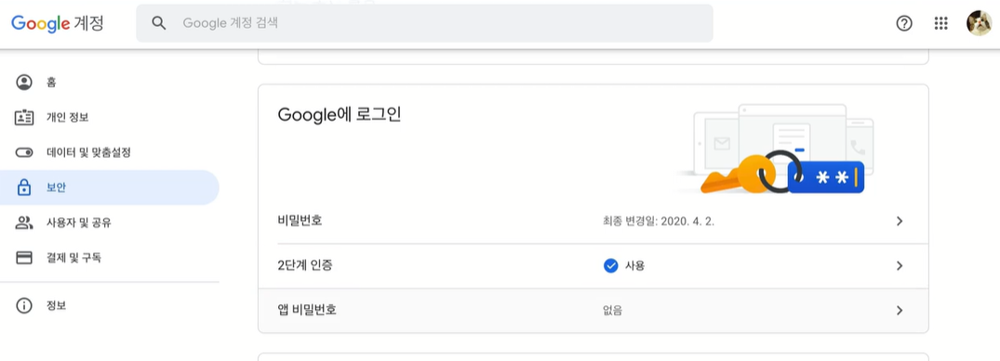
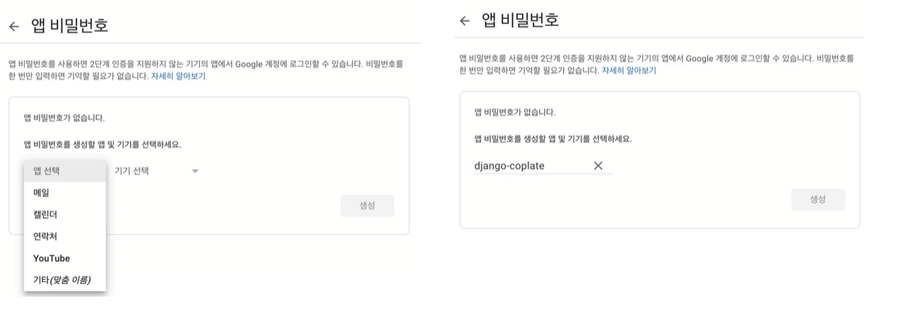

# E-mail

유저의 실제 이메일주소로 이메일 보내보자
이메일 전송 원리는 이메일이 도메인의 이메일 서버로 전달된다
이 서버가 수신 도메인의 이메일 서버로 이메일을 전송되어 이메일이 수신자에게 전달되는 것
이메일 전송만 다루는 서버를 **SMTP 서버**라고 한다

## SMTP

`Simple Mail Transfer Protocol`
`이메일을 전송할 때 사용되는 프로토콜(규약)`
웹페이지에 대한 요청을 보낼 때 http를 사용하듯 이메일을 보낼 때는 smtp를 사용하는 것임
장고 어플리케이션에서 이메일을 SMTP 서버로 보내면 SMTP서버는 이메일을 수신 도메인의 이메일 서버로 보내고  이메일은 수신자에게 전달된다


장고 어플리케이션을 사용할 때는 SMTP 서버를 따로 설정해 줘야 한다
지메일의 SMTP 서버를 사용해 이메일을 보내보자
장고가 지메일 계정을 사용할 수 있도록 해야 한다

 주소창에 myaccount.google.com 이라고 입력한 후
보안탭 클릭하고 2단계 인증을 활성화
앱 비밀번호를 클릭



비밀번호를 입력한 후 나오는 창에서 앱을 선택해서 밑에 있는 기타를 누른 후 앱 이름(아무거나 상관없음)을 작성하고 생성한다



이렇게 열여섯자리 비밀번호가 나오는데 잘 복붙해둔다
세팅 파일에 들어가서 

```python
EMAIL_BACKEND = "django.core.mail.backends.smtp.EmailBackend"
```

로 바꾸거나 지워준다 (사실 이게 디폴트임)

```python
# settings.py
EMAIL_HOST = "smtp.gmail.com"
EMAIL_PORT = 587
EMAIL_USE_TLS = True
EMAIL_HOST_USER = "지메일 아이디@gmail.com"
EMAIL_HOST_PASSWORD = "아까 복붙한 열여섯자리"
```
