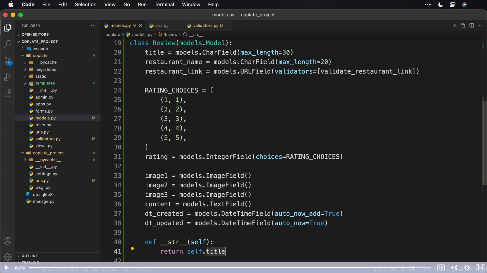
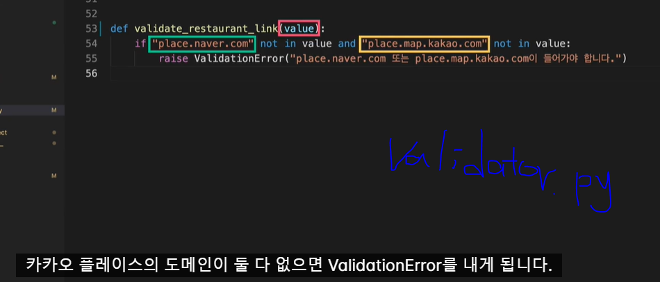
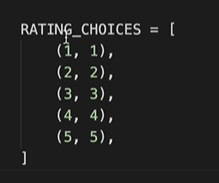
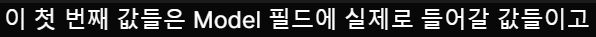

# Model

## _ _ str _ _

# 

# Model Field

Django는 데이터의 타입에 따라 알맞은 필드(Field)를 사용해서 데이터를 다룹니다. 여기서는 우리가 지금까지 사용했던 몇가지 필드 유형과 필드를 정의할 때 사용할 수 있는 옵션들을 정리해 보도록 하겠습니다.

## 필드 유형(Field Types)

아래는 모델을 정의할 때 데이터에 따라 사용할 수 있는 필드 유형으로 우리가 사용했던 필드들과 그외 타입이 비슷한 필드들의 목록입니다. 이 밖에도 다양한 형식의 필드가 있습니다. 아래의 공식문서를 참고하세요. [필드 유형 공식문서 바로 가기](https://docs.djangoproject.com/en/2.2/ref/models/fields/#model-field-types)

| 필드명           | 설명                                                   | 개별속성                                                                         |
| ------------- | ---------------------------------------------------- | ---------------------------------------------------------------------------- |
| CharField     | 최대 길이가 정해진 문자열 필드                                    | max_length (최대 글자수)                                                          |
| TextField     | 최대 길이가 정해지지 않은 문자열 필드                                |                                                                              |
| EmailField    | CharField와 같은 문자열 필드지만 입력된 형식이 이메일 형식 인지를 체크하는 필드 | max_length=254 (기본값)                                                         |
| URLField      | CharField과 같은 문자열 필드지만 입력된 형식이 URL 형식 인지를 체크하는 필드 | max_length=200 (기본값)                                                         |
| BooleanField  | True, False 값을 갖는 필드                                 |                                                                              |
| IntegerField  | 정수 형식의 필드                                            |                                                                              |
| FloatField    | 부동 소수점 형식의 필드                                        |                                                                              |
| DateField     | 날짜 형식의 필드                                            | auto_now (수정 될 때 마다 새로운 값으로 갱신) auto_now_add (생성 될 때 값이 입력 되고 추후 변경하지 않음) |
| TimeField     | 시간 형식의 필드                                            | auto_now, auto_now_add                                                       |
| DateTimeField | 날짜 시간 형식의 필드                                         | auto_now, auto_now_add                                                       |

## 필드 옵션(Field options)

모델 필드를 정의할 때 작성할 수 있는 몇 가지 옵션 항목 입니다. 모든 필드에 대해 적용할 수 있으며 반드시 필요한 것은 아니고 선택적으로 적용할 수 있습니다. 더 많은 필드 옵션이 궁금하다면 아래의 공식 문서를 참고하세요. [필드 옵션 공식문서 바로 가기](https://docs.djangoproject.com/en/2.2/ref/models/fields/#field-options)

| 필드 옵션        | 설명                                              | 기본값   |
| ------------ | ----------------------------------------------- | ----- |
| null         | True 일 경우 데이터베이스에 빈 값을 저장할 때 NULL을 사용하게 됩니다. | False |
| blank        | True 일 경우 해당 필드를 비워 둘 수 있게 합니다.                 | False |
| default      | 필드에 기본값을 지정할 때 사용합니다.                           |       |
| editable     | 필드의 수정 가능 여부를 설정합니다.                            | True  |
| help_text    | 해당 필드를 입력할 때 보여줄 도움말을 설정합니다.                    |       |
| unique       | True 일 경우 중복된 값을 입력할 수 없게 합니다.                  | False |
| verbose_name | 사람이 인식하기 좋은 별명을 필드에 설정합니다.                      |       |
| validators   | 필드의 유효성 검증에 사용할 검증 목록 입니다.                      |       |

보면 우리가 배운 것들도 있고 아직 배우지 않은 것들도 있죠? 대부분은 이어지는 레슨들에서 다룰 예정이지만 만약 다루지 않은 부분이 있더라도 걱정하지 마세요. 여러분이 배운 지식을 바탕으로 공식문서를 차근히 읽어보면 나머지 부분들을 사용하는 것도 어렵지 않을거에요.

